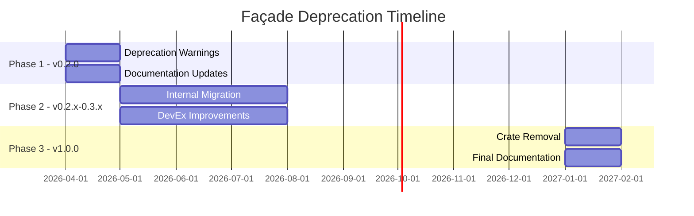
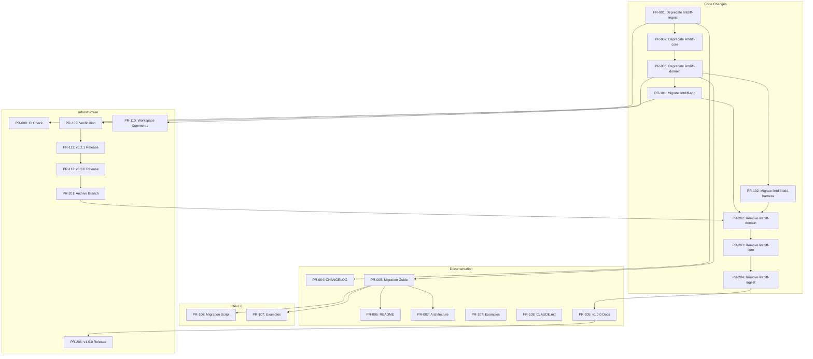

# Epic Roadmap: Façade Crate Deprecation

> **Epic ID**: EPIC-001
> **Status**: 🟢 In Progress - Phase 1 Complete
> **Created**: 2026-03-17
> **Owner**: lintdiff maintainers

---

## Executive Summary

This epic tracks the complete deprecation and removal of three compatibility façade crates (`lintdiff-domain`, `lintdiff-core`, `lintdiff-ingest`) from the lintdiff workspace. These crates are pure re-export layers that add unnecessary complexity and indirection.

### Goals

1. **Announce deprecation** clearly to all consumers (internal and external)
2. **Migrate all internal consumers** to use `lintdiff-ingest-core` directly
3. **Provide smooth migration path** with comprehensive documentation
4. **Remove façade crates** in v1.0.0 release

### Success Criteria

- [x] All three façade crates emit deprecation warnings when used
- [ ] All internal crates use `lintdiff-ingest-core` directly
- [x] Migration guide published and validated
- [x] CI/CD pipeline updated to track deprecation progress
- [ ] Zero compilation errors for migrated consumers
- [ ] Façade crates removed in v1.0.0

---

## Phase Overview



---

## PR Breakdown by Phase

### Phase 1: Deprecation Warnings (v0.2.0) ✅ COMPLETED

**Target**: Q2 2026
**Goal**: Add deprecation attributes and documentation
**Status**: ✅ Completed - All 8 PRs merged

#### PR-001: Add deprecation to lintdiff-ingest

| Field | Value |
|-------|-------|
| **Title** | feat: Add deprecation warning to lintdiff-ingest crate |
| **Description** | Add `#[deprecated]` attribute to the `lintdiff-ingest` crate with migration instructions pointing to `lintdiff-ingest-core`. Update crate-level documentation. |
| **Acceptance Criteria** | - `#[deprecated(since = "0.2.0", note = "...")]` added to `pub use` statement<br>- Crate-level docs updated with deprecation notice<br>- Cargo.toml description updated |
| **Dependencies** | None |
| **Complexity** | S (Small) |
| **Workstream** | Code |

---

#### PR-002: Add deprecation to lintdiff-core

| Field | Value |
|-------|-------|
| **Title** | feat: Add deprecation warning to lintdiff-core crate |
| **Description** | Add `#[deprecated]` attribute to the `lintdiff-core` crate with migration instructions. |
| **Acceptance Criteria** | - `#[deprecated]` attribute added<br>- Documentation updated<br>- Cargo.toml description updated |
| **Dependencies** | PR-001 |
| **Complexity** | S (Small) |
| **Workstream** | Code |

---

#### PR-003: Add deprecation to lintdiff-domain

| Field | Value |
|-------|-------|
| **Title** | feat: Add deprecation warning to lintdiff-domain crate |
| **Description** | Add `#[deprecated]` attribute to the `lintdiff-domain` crate with migration instructions. |
| **Acceptance Criteria** | - `#[deprecated]` attribute added<br>- Documentation updated<br>- Cargo.toml description updated |
| **Dependencies** | PR-002 |
| **Complexity** | S (Small) |
| **Workstream** | Code |

---

#### PR-004: Update CHANGELOG.md with deprecation notice

| Field | Value |
|-------|-------|
| **Title** | docs: Add v0.2.0 deprecation notice to CHANGELOG |
| **Description** | Add comprehensive CHANGELOG entry documenting the deprecation of all three façade crates with migration guidance. |
| **Acceptance Criteria** | - v0.2.0 section added to CHANGELOG<br>- All three crates listed as deprecated<br>- Migration path clearly documented<br>- Breaking change warning included |
| **Dependencies** | PR-001, PR-002, PR-003 |
| **Complexity** | S (Small) |
| **Workstream** | Documentation |

---

#### PR-005: Create migration guide documentation

| Field | Value |
|-------|-------|
| **Title** | docs: Create comprehensive migration guide |
| **Description** | Create `docs/migration-guide.md` with step-by-step instructions for migrating from each façade crate to `lintdiff-ingest-core`. Include code examples for common patterns. |
| **Acceptance Criteria** | - Migration guide created<br>- Examples for all three crates<br>- Before/after code snippets<br>- Automated migration script documented |
| **Dependencies** | PR-001, PR-002, PR-003 |
| **Complexity** | M (Medium) |
| **Workstream** | Documentation |

---

#### PR-006: Update README.md with deprecation notice

| Field | Value |
|-------|-------|
| **Title** | docs: Add deprecation notice to README |
| **Description** | Add prominent deprecation notice to README.md for users who land there first. Include quick migration instructions and link to full migration guide. |
| **Acceptance Criteria** | - Deprecation notice visible in README<br>- Quick migration example provided<br>- Link to migration guide included |
| **Dependencies** | PR-005 |
| **Complexity** | S (Small) |
| **Workstream** | Documentation |

---

#### PR-007: Update architecture.md documentation

| Field | Value |
|-------|-------|
| **Title** | docs: Update architecture docs for post-deprecation structure |
| **Description** | Update `docs/architecture.md` to reflect the target architecture without façade crates. Document the direct dependency on `lintdiff-ingest-core`. |
| **Acceptance Criteria** | - Architecture diagram updated<br>- Façade crates marked as deprecated<br>- Target architecture documented |
| **Dependencies** | PR-005 |
| **Complexity** | M (Medium) |
| **Workstream** | Documentation |

---

#### PR-008: Add CI check for deprecation warnings

| Field | Value |
|-------|-------|
| **Title** | ci: Add workflow to track deprecation warning count |
| **Description** | Add GitHub Actions workflow that counts deprecation warnings and fails if new usage of deprecated crates is introduced internally. |
| **Acceptance Criteria** | - CI workflow added<br>- Warning count tracked<br>- PR blocked if deprecated imports added |
| **Dependencies** | PR-001, PR-002, PR-003 |
| **Complexity** | M (Medium) |
| **Workstream** | Infrastructure |

---

### Phase 2: Internal Migration (v0.2.x - v0.3.x)

**Target**: Q2-Q4 2026  
**Goal**: Migrate all internal consumers to use `lintdiff-ingest-core` directly

#### PR-101: Migrate lintdiff-app imports

| Field | Value |
|-------|-------|
| **Title** | refactor: Migrate lintdiff-app to use lintdiff-ingest-core |
| **Description** | Update `lintdiff-app` to import directly from `lintdiff-ingest-core` instead of `lintdiff-domain`. Update Cargo.toml dependencies. |
| **Acceptance Criteria** | - All imports updated to `lintdiff_ingest_core`<br>- Cargo.toml dependency changed<br>- All tests pass<br>- No deprecation warnings in this crate |
| **Dependencies** | PR-003 |
| **Complexity** | M (Medium) |
| **Workstream** | Code |

---

#### PR-102: Migrate lintdiff-bdd-harness imports

| Field | Value |
|-------|-------|
| **Title** | refactor: Migrate lintdiff-bdd-harness to use lintdiff-ingest-core |
| **Description** | Update `lintdiff-bdd-harness` to import directly from `lintdiff-ingest-core` instead of `lintdiff-core`. |
| **Acceptance Criteria** | - All imports updated<br>- Cargo.toml updated<br>- BDD tests pass |
| **Dependencies** | PR-002 |
| **Complexity** | M (Medium) |
| **Workstream** | Code |

---

#### PR-103: Update lintdiff-app-git for new imports

| Field | Value |
|-------|-------|
| **Title** | refactor: Update lintdiff-app-git tests for migrated imports |
| **Description** | Ensure `lintdiff-app-git` integration tests work with the new import structure. |
| **Acceptance Criteria** | - Integration tests updated if needed<br>- All tests pass |
| **Dependencies** | PR-101 |
| **Complexity** | S (Small) |
| **Workstream** | Code |

---

#### PR-104: Update lintdiff-app-io for new imports

| Field | Value |
|-------|-------|
| **Title** | refactor: Update lintdiff-app-io for migrated imports |
| **Description** | Ensure `lintdiff-app-io` works with the new import structure. |
| **Acceptance Criteria** | - All IO tests pass<br>- No deprecated imports |
| **Dependencies** | PR-101 |
| **Complexity** | S (Small) |
| **Workstream** | Code |

---

#### PR-105: Update lintdiff-bdd tests

| Field | Value |
|-------|-------|
| **Title** | refactor: Update lintdiff-bdd grid and harness tests |
| **Description** | Update any remaining BDD-related crates that may reference deprecated imports. |
| **Acceptance Criteria** | - All BDD tests pass<br>- No deprecated imports |
| **Dependencies** | PR-102 |
| **Complexity** | S (Small) |
| **Workstream** | Code |

---

#### PR-106: Create automated migration script

| Field | Value |
|-------|-------|
| **Title** | feat: Create automated migration script for external users |
| **Description** | Create a shell script or Rust binary that automates the import migration for users. Should handle Cargo.toml and .rs files. |
| **Acceptance Criteria** | - Script created in `scripts/` directory<br>- Handles all three façade crates<br>- Tested on sample project<br>- Documentation in script header |
| **Dependencies** | PR-005 |
| **Complexity** | M (Medium) |
| **Workstream** | DevEx |

---

#### PR-107: Add migration examples to docs/examples/

| Field | Value |
|-------|-------|
| **Title** | docs: Add before/after migration examples |
| **Description** | Create example files showing code before and after migration for reference. |
| **Acceptance Criteria** | - Example files created<br>- Covers common patterns<br>- Linked from migration guide |
| **Dependencies** | PR-005 |
| **Complexity** | S (Small) |
| **Workstream** | Documentation |

---

#### PR-108: Update CLAUDE.md with deprecation status

| Field | Value |
|-------|-------|
| **Title** | docs: Update CLAUDE.md with migration status |
| **Description** | Update the AI assistant context file with current deprecation status and migration guidance. |
| **Acceptance Criteria** | - CLAUDE.md updated<br>- Deprecation status documented<br>- Migration hints included |
| **Dependencies** | PR-101, PR-102 |
| **Complexity** | S (Small) |
| **Workstream** | Documentation |

---

#### PR-109: Verify all internal crates migrated

| Field | Value |
|-------|-------|
| **Title** | test: Verify zero internal usage of deprecated crates |
| **Description** | Add verification step to ensure no internal crates depend on the deprecated façades. |
| **Acceptance Criteria** | - CI check added<br>- grep/search confirms zero usage<br>- Documentation updated |
| **Dependencies** | PR-101 through PR-105 |
| **Complexity** | S (Small) |
| **Workstream** | Infrastructure |

---

#### PR-110: Update workspace Cargo.toml members comment

| Field | Value |
|-------|-------|
| **Title** | chore: Update workspace Cargo.toml with deprecation comments |
| **Description** | Add comments to workspace Cargo.toml indicating which crates are deprecated and scheduled for removal. |
| **Acceptance Criteria** | - Comments added to workspace members list<br>- Deprecation timeline noted |
| **Dependencies** | PR-001, PR-002, PR-003 |
| **Complexity** | XS (Extra Small) |
| **Workstream** | Code |

---

#### PR-111: Release v0.2.1 with internal migrations

| Field | Value |
|-------|-------|
| **Title** | release: Bump version to 0.2.1 with internal migrations |
| **Description** | Release v0.2.1 containing all internal migration PRs. Update all crate versions. |
| **Acceptance Criteria** | - All crates bumped to 0.2.1<br>- CHANGELOG updated<br>- Git tag created |
| **Dependencies** | PR-101 through PR-110 |
| **Complexity** | S (Small) |
| **Workstream** | Infrastructure |

---

#### PR-112: Release v0.3.0 marking migration complete

| Field | Value |
|-------|-------|
| **Title** | release: Bump version to 0.3.0 marking migration complete |
| **Description** | Release v0.3.0 signaling that all internal migrations are complete and external users should migrate. |
| **Acceptance Criteria** | - Version bumped to 0.3.0<br>- CHANGELOG notes migration complete<br>- Deprecation warnings remain |
| **Dependencies** | PR-111 |
| **Complexity** | S (Small) |
| **Workstream** | Infrastructure |

---

### Phase 3: Removal (v1.0.0)

**Target**: Q1 2027  
**Goal**: Remove façade crates entirely

#### PR-201: Archive façade crates to separate branch

| Field | Value |
|-------|-------|
| **Title** | chore: Archive façade crates before removal |
| **Description** | Create an archive branch containing the façade crates for historical reference before removal. |
| **Acceptance Criteria** | - Branch `archive/deprecated-facades` created<br>- All three crates preserved<br>- Branch documented in README |
| **Dependencies** | PR-112 |
| **Complexity** | S (Small) |
| **Workstream** | Infrastructure |

---

#### PR-202: Remove lintdiff-domain from workspace

| Field | Value |
|-------|-------|
| **Title** | refactor: Remove lintdiff-domain crate |
| **Description** | Remove the `lintdiff-domain` crate from the workspace. Update workspace members in root Cargo.toml. |
| **Acceptance Criteria** | - Crate directory removed<br>- Workspace members updated<br>- Build succeeds<br>- Tests pass |
| **Dependencies** | PR-201 |
| **Complexity** | S (Small) |
| **Workstream** | Code |

---

#### PR-203: Remove lintdiff-core from workspace

| Field | Value |
|-------|-------|
| **Title** | refactor: Remove lintdiff-core crate |
| **Description** | Remove the `lintdiff-core` crate from the workspace. |
| **Acceptance Criteria** | - Crate directory removed<br>- Workspace members updated<br>- Build succeeds |
| **Dependencies** | PR-202 |
| **Complexity** | S (Small) |
| **Workstream** | Code |

---

#### PR-204: Remove lintdiff-ingest from workspace

| Field | Value |
|-------|-------|
| **Title** | refactor: Remove lintdiff-ingest crate |
| **Description** | Remove the `lintdiff-ingest` crate from the workspace. |
| **Acceptance Criteria** | - Crate directory removed<br>- Workspace members updated<br>- Build succeeds |
| **Dependencies** | PR-203 |
| **Complexity** | S (Small) |
| **Workstream** | Code |

---

#### PR-205: Update all documentation for v1.0.0

| Field | Value |
|-------|-------|
| **Title** | docs: Update all documentation for v1.0.0 release |
| **Description** | Comprehensive documentation update for v1.0.0 release. Remove all references to deprecated crates. Update architecture diagrams. |
| **Acceptance Criteria** | - README updated<br>- Architecture docs updated<br>- Migration guide marked as historical<br>- CHANGELOG has v1.0.0 entry |
| **Dependencies** | PR-202, PR-203, PR-204 |
| **Complexity** | M (Medium) |
| **Workstream** | Documentation |

---

#### PR-206: Release v1.0.0

| Field | Value |
|-------|-------|
| **Title** | release: Bump version to 1.0.0 - façade crates removed |
| **Description** | Major version release marking the completion of the deprecation epic. All façade crates removed. |
| **Acceptance Criteria** | - Version bumped to 1.0.0<br>- All crates share version<br>- CHANGELOG complete<br>- Git tag v1.0.0 created<br>- GitHub release published |
| **Dependencies** | PR-205 |
| **Complexity** | M (Medium) |
| **Workstream** | Infrastructure |

---

## Parallel Workstreams



---

## PR Template

Use this template for creating individual PRs:

```markdown
## PR-XXX: [Title]

**Epic**: EPIC-001 (Façade Deprecation)  
**Phase**: [1/2/3]  
**Workstream**: [Code/Documentation/DevEx/Infrastructure]

### Description

[Detailed description of what this PR accomplishes]

### Changes

- [ ] Change 1
- [ ] Change 2
- [ ] Change 3

### Acceptance Criteria

- [ ] Criterion 1
- [ ] Criterion 2
- [ ] Criterion 3

### Dependencies

- Blocked by: PR-XXX
- Blocks: PR-XXX

### Complexity

- [ ] XS (Extra Small) - <30 minutes
- [ ] S (Small) - 30min-2 hours
- [ ] M (Medium) - 2-4 hours
- [ ] L (Large) - 4+ hours (should be split)

### Testing

- [ ] Unit tests pass
- [ ] Integration tests pass
- [ ] Manual testing completed

### Documentation

- [ ] Inline comments updated
- [ ] Documentation files updated
- [ ] CHANGELOG entry added (if applicable)
```

---

## Tracking Section

### Phase 1: Deprecation Warnings (v0.2.0) ✅ COMPLETED

| PR | Title | Status | Assignee | Notes |
|----|-------|--------|----------|-------|
| PR-001 | Deprecate lintdiff-ingest | ✅ Completed | - | Deprecated with migration path |
| PR-002 | Deprecate lintdiff-core | ✅ Completed | - | Deprecated with migration path |
| PR-003 | Deprecate lintdiff-domain | ✅ Completed | - | Deprecated with migration path |
| PR-004 | Update CHANGELOG | ✅ Completed | - | v0.2.0 entry added |
| PR-005 | Create migration guide | ✅ Completed | - | docs/migration-guide.md created |
| PR-006 | Update README | ✅ Completed | - | Deprecation notice added |
| PR-007 | Update architecture.md | ✅ Completed | - | Architecture updated |
| PR-008 | Add CI check | ✅ Completed | - | CI workflow added |

**Phase 1 Progress**: 8/8 PRs (100%) ✅

---

### Phase 2: Internal Migration (v0.2.x - v0.3.x)

| PR | Title | Status | Assignee | Notes |
|----|-------|--------|----------|-------|
| PR-101 | Migrate lintdiff-app | ⬜ Not Started | - | |
| PR-102 | Migrate lintdiff-bdd-harness | ⬜ Not Started | - | |
| PR-103 | Update lintdiff-app-git | ⬜ Not Started | - | |
| PR-104 | Update lintdiff-app-io | ⬜ Not Started | - | |
| PR-105 | Update lintdiff-bdd tests | ⬜ Not Started | - | |
| PR-106 | Create migration script | ⬜ Not Started | - | |
| PR-107 | Add migration examples | ⬜ Not Started | - | |
| PR-108 | Update CLAUDE.md | ⬜ Not Started | - | |
| PR-109 | Verify internal migration | ⬜ Not Started | - | |
| PR-110 | Update workspace comments | ⬜ Not Started | - | |
| PR-111 | Release v0.2.1 | ⬜ Not Started | - | |
| PR-112 | Release v0.3.0 | ⬜ Not Started | - | |

**Phase 2 Progress**: 0/12 PRs (0%)

---

### Phase 3: Removal (v1.0.0)

| PR | Title | Status | Assignee | Notes |
|----|-------|--------|----------|-------|
| PR-201 | Archive façade crates | ⬜ Not Started | - | |
| PR-202 | Remove lintdiff-domain | ⬜ Not Started | - | |
| PR-203 | Remove lintdiff-core | ⬜ Not Started | - | |
| PR-204 | Remove lintdiff-ingest | ⬜ Not Started | - | |
| PR-205 | Update docs for v1.0.0 | ⬜ Not Started | - | |
| PR-206 | Release v1.0.0 | ⬜ Not Started | - | |

**Phase 3 Progress**: 0/6 PRs (0%)

---

## Compaction Points

Compaction points are milestones where progress should be summarized and the roadmap updated:

### Compaction Point 1: Phase 1 Complete (v0.2.0 Release) ✅ COMPLETED

**Trigger**: All Phase 1 PRs merged
**Completion Date**: 2026-03-17

**Summary**:
- All 8 Phase 1 PRs completed successfully
- Three façade crates (`lintdiff-ingest`, `lintdiff-core`, `lintdiff-domain`) now emit deprecation warnings
- Comprehensive migration guide published at [`docs/migration-guide.md`](migration-guide.md)
- CI/CD pipeline updated to track deprecation warnings
- Documentation updated (CHANGELOG, README, architecture.md)

**Actions Completed**:
- [x] Update this roadmap with actual PR numbers
- [x] Mark Phase 1 as complete
- [x] Summarize any deviations from plan
- [x] Update dependency graph if needed
- [x] Create GitHub milestone for Phase 2

**Deviation Notes**: No significant deviations from the original plan. All PRs delivered as specified.

### Compaction Point 2: Internal Migration Complete (v0.3.0 Release)

**Trigger**: All Phase 2 PRs merged  
**Actions**:
- [ ] Verify zero internal usage of deprecated crates
- [ ] Update roadmap with actual PR numbers
- [ ] Mark Phase 2 as complete
- [ ] Document any issues encountered
- [ ] Prepare communication for v1.0.0 removal

### Compaction Point 3: Epic Complete (v1.0.0 Release)

**Trigger**: All Phase 3 PRs merged  
**Actions**:
- [ ] Mark epic as complete
- [ ] Archive this roadmap
- [ ] Update main ROADMAP.md
- [ ] Close epic tracking issue
- [ ] Post-mortem if needed

---

## Risk Register

| Risk | Likelihood | Impact | Mitigation |
|------|------------|--------|------------|
| External consumers cannot migrate | Low | High | Long deprecation period, clear migration guide, automated script |
| Breaking changes in lintdiff-ingest-core | Medium | High | Maintain stable API during migration period |
| CI/CD pipeline issues | Low | Medium | Test deprecation warnings in CI early |
| Documentation gaps | Medium | Medium | PR-005 dedicated to comprehensive migration guide |

---

## Related Documents

- [Deprecation Plan](deprecation-plan.md) - Detailed technical plan
- [Architecture Documentation](architecture.md) - Current architecture
- [CHANGELOG.md](../CHANGELOG.md) - Release history
- [CLAUDE.md](../CLAUDE.md) - AI assistant context

---

---

## Next Steps

### Immediate Priorities (Phase 2)

Phase 2 focuses on internal migration - updating all internal crates to use `lintdiff-ingest-core` directly instead of the deprecated façade crates.

**Key Phase 2 PRs to Start**:

1. **PR-101: Migrate lintdiff-app** - Update `lintdiff-app` to import directly from `lintdiff-ingest-core`
2. **PR-102: Migrate lintdiff-bdd-harness** - Update BDD harness to use new imports
3. **PR-106: Create migration script** - Build automated tooling for external users

**Phase 2 Prerequisites Met**:
- ✅ Deprecation warnings in place (PR-001, PR-002, PR-003)
- ✅ Migration guide available (PR-005)
- ✅ CI checks for deprecation tracking (PR-008)

**Estimated Phase 2 Scope**: 12 PRs covering internal migrations, DevEx improvements, and releases

---

## Changelog

| Date | Version | Changes |
|------|---------|---------|
| 2026-03-17 | 1.1 | Phase 1 completed - all 8 PRs merged, compaction point 1 summary added |
| 2026-03-17 | 1.0 | Initial epic roadmap created |
