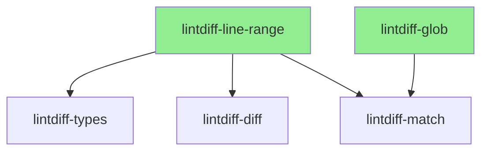
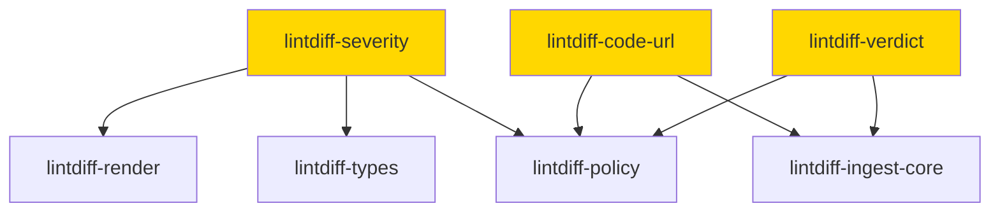
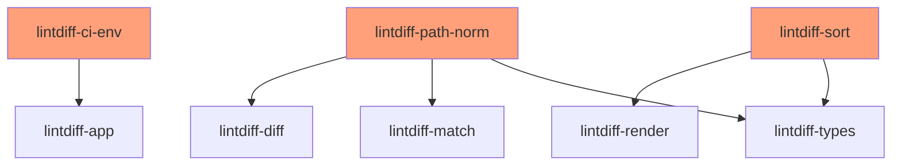

# Microcrate Expansion - Phase 2

## Executive Summary

This document analyzes the existing lintdiff crates and identifies 8 new microcrate extraction opportunities following the Single Responsibility Principle (SRP). These extractions will improve modularity, enable parallel development, and create reusable components.

## Current State Analysis

### Already Extracted Microcrates (Phase 1)

| Crate | Responsibility | Lines |
|-------|---------------|-------|
| `lintdiff-exit` | Exit code classification | ~60 |
| `lintdiff-stats` | Statistics collection | ~150 |
| `lintdiff-render-markdown` | Markdown table rendering | ~180 |
| `lintdiff-render-annotations` | GitHub annotations | ~170 |
| `lintdiff-explain` | Diagnostic explanations | ~200 |
| `lintdiff-truncate` | String truncation | ~180 |
| `lintdiff-config` | Configuration loading | ~200 |
| `lintdiff-escape` | Output escaping | ~200 |
| `lintdiff-locale-detect` | Locale detection | ~150 |

### Analyzed Crates

#### [`lintdiff-ingest-core`](crates/lintdiff-ingest-core/src/lib.rs) - 712 lines

**Current Responsibilities:**
- Main ingest pipeline orchestration
- Diagnostic-to-finding transformation
- Span matching against diff ranges
- Message truncation (duplicates `lintdiff-truncate`)
- Explain summary building
- Report finalization

**Issues:**
- [`truncate_message()`](crates/lintdiff-ingest-core/src/lib.rs:401) duplicates functionality in `lintdiff-truncate`
- Multiple responsibilities in single file

#### [`lintdiff-render`](crates/lintdiff-render/src/lib.rs) - 549 lines

**Current Responsibilities:**
- Markdown rendering (delegates to `lintdiff-render-markdown`)
- GitHub annotations rendering (delegates to `lintdiff-render-annotations`)
- Utility functions: `sev_badge()`, `format_location()`, `escape_table()`, `escape_github_command()`

**Status:** Mostly a facade crate now. Could be deprecated once migrations complete.

#### [`lintdiff-match`](crates/lintdiff-match/src/lib.rs) - 157 lines + modules

**Modules:**
- [`filters.rs`](crates/lintdiff-match/src/filters.rs:1) - Glob-based path filtering (101 lines)
- [`paths.rs`](crates/lintdiff-match/src/paths.rs:1) - Path relativization (128 lines)
- [`spans.rs`](crates/lintdiff-match/src/spans.rs:1) - Span selection (11 lines)

**Extraction Candidates:**
- Glob filtering logic is self-contained
- Path relativization is reusable

#### [`lintdiff-policy`](crates/lintdiff-policy/src/lib.rs) - 104 lines + modules

**Modules:**
- [`code.rs`](crates/lintdiff-policy/src/code.rs:1) - Code normalization and URL generation (107 lines)
- [`fingerprint.rs`](crates/lintdiff-policy/src/fingerprint.rs:1) - Re-exports from `lintdiff-fingerprint` (1 line)
- [`verdict.rs`](crates/lintdiff-policy/src/verdict.rs:1) - Verdict computation (204 lines)

**Extraction Candidates:**
- Code normalization with URL generation
- Verdict computation logic

#### [`lintdiff-types`](crates/lintdiff-types/src/lib.rs) - 156 lines + modules

**Modules:**
- [`config.rs`](crates/lintdiff-types/src/config.rs:1) - Configuration types (149 lines)
- [`ordering.rs`](crates/lintdiff-types/src/ordering.rs:1) - Finding ordering (43 lines)
- [`path.rs`](crates/lintdiff-types/src/path.rs:1) - Path normalization and LineRange (100 lines)
- [`report.rs`](crates/lintdiff-types/src/report.rs:1) - Report structures (161 lines)

**Extraction Candidates:**
- `LineRange` is a fundamental type used across crates
- Ordering logic is self-contained

#### [`lintdiff-diagnostics`](crates/lintdiff-diagnostics/src/lib.rs) - 353 lines

**Current Responsibilities:**
- Cargo JSON message parsing
- `Diagnostic`, `DiagnosticLevel`, `Span` types
- Error handling

**Status:** Well-focused, no extraction needed.

#### [`lintdiff-diff`](crates/lintdiff-diff/src/lib.rs) - 377 lines

**Current Responsibilities:**
- Unified diff parsing
- `DiffMap`, `DiffStats` types
- Hunk header parsing
- Line range merging

**Status:** Well-focused, no extraction needed.

---

## Proposed New Microcrates

### 1. `lintdiff-glob` (Priority: High)

**Single Responsibility:** Glob pattern compilation and matching for path filtering.

**Extracted From:** [`lintdiff-match/src/filters.rs`](crates/lintdiff-match/src/filters.rs:1)

**Code to Extract:**
```rust
// From lintdiff-match/src/filters.rs
pub struct Filters {
    pub include: Option<GlobSet>,
    pub exclude: Option<GlobSet>,
}

pub fn compile_filters(cfg: &EffectiveConfig) -> Filters { ... }
pub fn path_allowed(filters: &Filters, path: &str) -> bool { ... }
fn build_globset(patterns: &[String]) -> Option<GlobSet> { ... }
```

**Proposed Public API:**
```rust
/// Compiled glob filters for path matching.
pub struct GlobFilters {
    include: Option<GlobSet>,
    exclude: Option<GlobSet>,
}

impl GlobFilters {
    /// Compile filters from include/exclude patterns.
    pub fn new(include: &[String], exclude: &[String]) -> Self { ... }
    
    /// Check if a path passes the filter.
    pub fn is_allowed(&self, path: &str) -> bool { ... }
}

/// Build a GlobSet from patterns.
pub fn build_globset(patterns: &[String]) -> Option<GlobSet> { ... }
```

**Dependencies:**
- `globset` (external)

**Dependents:**
- `lintdiff-match` (will re-export for backward compatibility)
- `lintdiff-ingest-core`

**Rationale:**
- Glob filtering is a standalone concern
- Could be reused for other path-based filtering needs
- Small, focused API surface

---

### 2. `lintdiff-line-range` (Priority: High)

**Single Responsibility:** Inclusive 1-based line range operations.

**Extracted From:** [`lintdiff-types/src/path.rs`](crates/lintdiff-types/src/path.rs:78)

**Code to Extract:**
```rust
// From lintdiff-types/src/path.rs
#[derive(Clone, Copy, Debug, Eq, PartialEq, Ord, PartialOrd, Hash, Serialize, Deserialize)]
pub struct LineRange {
    pub start: u32,
    pub end: u32,
}

impl LineRange {
    pub fn new(start: u32, end: u32) -> Self { ... }
    pub fn intersects(&self, other: &LineRange) -> bool { ... }
    pub fn contains_line(&self, line: u32) -> bool { ... }
}
```

**Proposed Public API:**
```rust
/// Inclusive 1-based line range.
#[derive(Clone, Copy, Debug, Eq, PartialEq, Ord, PartialOrd, Hash, Serialize, Deserialize)]
pub struct LineRange {
    pub start: u32,
    pub end: u32,
}

impl LineRange {
    /// Create a new line range (1-based, inclusive).
    pub fn new(start: u32, end: u32) -> Self { ... }
    
    /// Check if this range intersects another.
    pub fn intersects(&self, other: &LineRange) -> bool { ... }
    
    /// Check if a line is within this range.
    pub fn contains_line(&self, line: u32) -> bool { ... }
    
    /// Merge overlapping ranges into minimal set.
    pub fn merge_overlapping(ranges: Vec<LineRange>) -> Vec<LineRange> { ... }
    
    /// Check if any range in a list contains the line.
    pub fn any_contains(ranges: &[LineRange], line: u32) -> bool { ... }
}
```

**Dependencies:**
- `serde` (optional, for serialization)

**Dependents:**
- `lintdiff-types` (will re-export)
- `lintdiff-diff`
- `lintdiff-match`
- `lintdiff-ingest-core`

**Rationale:**
- Fundamental type used across multiple crates
- Small API with clear semantics
- Can be independently tested and versioned

---

### 3. `lintdiff-severity` (Priority: Medium)

**Single Responsibility:** Severity levels and level-to-severity mapping.

**Extracted From:** 
- [`lintdiff-types/src/report.rs`](crates/lintdiff-types/src/report.rs:107) (`Severity` enum)
- [`lintdiff-policy/src/code.rs`](crates/lintdiff-policy/src/code.rs:4) (`map_level_to_severity`)

**Code to Extract:**
```rust
// From lintdiff-types/src/report.rs
#[derive(Clone, Copy, Debug, PartialEq, Eq, Serialize, Deserialize)]
#[serde(rename_all = "lowercase")]
pub enum Severity {
    Info,
    Warn,
    Error,
}

// From lintdiff-policy/src/code.rs
pub fn map_level_to_severity(level: &DiagnosticLevel) -> Severity { ... }
pub fn format_level(level: &DiagnosticLevel) -> String { ... }
```

**Proposed Public API:**
```rust
/// Finding severity level.
#[derive(Clone, Copy, Debug, PartialEq, Eq, PartialOrd, Ord, Serialize, Deserialize)]
#[serde(rename_all = "lowercase")]
pub enum Severity {
    Info,
    Warn,
    Error,
}

impl Severity {
    /// Get display badge for markdown/annotations.
    pub fn badge(&self) -> &'static str {
        match self {
            Severity::Error => "error",
            Severity::Warn => "warn",
            Severity::Info => "info",
        }
    }
    
    /// Parse from string.
    pub fn from_str(s: &str) -> Option<Self> { ... }
}

/// Map diagnostic level to severity.
pub fn level_to_severity(level: &DiagnosticLevel) -> Severity { ... }
```

**Dependencies:**
- `serde` (optional)
- `lintdiff-diagnostics` (for `DiagnosticLevel` - optional)

**Dependents:**
- `lintdiff-types`
- `lintdiff-policy`
- `lintdiff-render`
- `lintdiff-stats`

**Rationale:**
- Severity is a cross-cutting concern
- Centralizes severity-related logic
- Reduces coupling between policy and types

---

### 4. `lintdiff-code-url` (Priority: Medium)

**Single Responsibility:** Diagnostic code normalization and documentation URL generation.

**Extracted From:** [`lintdiff-policy/src/code.rs`](crates/lintdiff-policy/src/code.rs:23)

**Code to Extract:**
```rust
// From lintdiff-policy/src/code.rs
pub fn normalize_diagnostic_code(raw: Option<&str>) -> (String, Option<String>) { ... }
fn is_rustc_error_code(raw: &str) -> bool { ... }
fn slugify(s: &str) -> String { ... }
```

**Proposed Public API:**
```rust
/// Normalized diagnostic code with optional documentation URL.
#[derive(Clone, Debug, PartialEq, Eq)]
pub struct NormalizedCode {
    /// The normalized code identifier (e.g., "lintdiff.diagnostic.clippy.needless_borrow").
    pub code: String,
    /// Optional URL to documentation for this diagnostic.
    pub url: Option<String>,
}

impl NormalizedCode {
    /// Normalize a raw diagnostic code.
    pub fn from_raw(raw: Option<&str>) -> Self { ... }
    
    /// Check if this is a clippy lint.
    pub fn is_clippy(&self) -> bool { ... }
    
    /// Check if this is a rustc error code.
    pub fn is_rustc_error(&self) -> bool { ... }
}

/// Normalize a diagnostic code to stable identifier + optional URL.
pub fn normalize_diagnostic_code(raw: Option<&str>) -> NormalizedCode { ... }

/// Convert a string to a URL-safe slug.
pub fn slugify(s: &str) -> String { ... }
```

**Dependencies:**
- None (pure computation)

**Dependents:**
- `lintdiff-policy`
- `lintdiff-ingest-core`

**Rationale:**
- Code normalization is a standalone concern
- URL generation logic is self-contained
- Could be extended for other linters (e.g., ESLint, RuboCop)

---

### 5. `lintdiff-verdict` (Priority: Medium)

**Single Responsibility:** Verdict computation from findings based on policy.

**Extracted From:** [`lintdiff-policy/src/verdict.rs`](crates/lintdiff-policy/src/verdict.rs:1)

**Code to Extract:**
```rust
// From lintdiff-policy/src/verdict.rs
pub fn counts_from_findings(findings: &[Finding]) -> Counts { ... }
pub fn compute_verdict(
    cfg: &EffectiveConfig,
    findings: &[Finding],
    suppressed: u32,
    denied: u32,
) -> Verdict { ... }
```

**Proposed Public API:**
```rust
/// Count findings by severity.
pub fn count_by_severity(findings: &[Finding]) -> SeverityCounts { ... }

/// Compute verdict from findings and configuration.
pub fn compute_verdict(
    fail_on: FailOn,
    findings: &[Finding],
    suppressed_count: u32,
    denied_count: u32,
) -> Verdict { ... }

/// Severity counts for a collection of findings.
#[derive(Clone, Debug, Default)]
pub struct SeverityCounts {
    pub error: u32,
    pub warn: u32,
    pub info: u32,
}

/// Computed verdict status.
#[derive(Clone, Debug)]
pub struct Verdict {
    pub status: VerdictStatus,
    pub counts: SeverityCounts,
    pub reasons: Vec<String>,
}
```

**Dependencies:**
- `lintdiff-types` (for `Finding`, `FailOn`)

**Dependents:**
- `lintdiff-policy`
- `lintdiff-ingest-core`

**Rationale:**
- Verdict computation is a distinct responsibility
- Can be tested independently
- Clear input/output contract

---

### 6. `lintdiff-ci-env` (Priority: Low)

**Single Responsibility:** CI environment detection and configuration.

**Extracted From:** [`lintdiff-app/src/lib.rs`](crates/lintdiff-app/src/lib.rs:287)

**Code to Extract:**
```rust
// From lintdiff-app/src/lib.rs
pub fn run_ci_github(...) -> Result<IngestOutcome, AppError> {
    let base = base_override.or_else(|| std::env::var("GITHUB_BASE_REF").ok());
    let head = head_override
        .or_else(|| std::env::var("GITHUB_SHA").ok())
        .or_else(|| std::env::var("GITHUB_HEAD_REF").ok());
    // ...
}
```

**Proposed Public API:**
```rust
/// Detected CI environment.
#[derive(Clone, Debug)]
pub enum CiEnvironment {
    GitHubActions {
        base_ref: Option<String>,
        head_ref: Option<String>,
        workspace: Option<PathBuf>,
        sha: Option<String>,
    },
    GitLabCi {
        // ...
    },
    CircleCi {
        // ...
    },
    None,
}

/// Detect the current CI environment.
pub fn detect_ci() -> CiEnvironment { ... }

/// Get base/head refs from CI environment.
pub fn get_diff_refs(ci: &CiEnvironment) -> Option<(String, String)> { ... }

/// Get workspace path from CI environment.
pub fn get_workspace(ci: &CiEnvironment) -> Option<PathBuf> { ... }
```

**Dependencies:**
- None (stdlib only)

**Dependents:**
- `lintdiff-app`

**Rationale:**
- CI detection is a cross-cutting concern
- Could support multiple CI providers
- Enables testing without CI environment

---

### 7. `lintdiff-path-norm` (Priority: Low)

**Single Responsibility:** Path normalization and relativization.

**Extracted From:**
- [`lintdiff-types/src/path.rs`](crates/lintdiff-types/src/path.rs:44) (`normalize_path`)
- [`lintdiff-match/src/paths.rs`](crates/lintdiff-match/src/paths.rs:3) (`relativize_span_path`)

**Code to Extract:**
```rust
// From lintdiff-types/src/path.rs
pub fn normalize_path(raw: &str) -> NormPath { ... }

// From lintdiff-match/src/paths.rs
pub fn relativize_span_path(
    file: &NormPath,
    repo_root: Option<&NormPath>,
    workspace_only: bool,
) -> Option<NormPath> { ... }
fn normalize_separators(s: &str) -> String { ... }
fn looks_absolute(s: &str) -> bool { ... }
```

**Proposed Public API:**
```rust
/// Normalized path (forward slashes, no leading ./).
#[derive(Clone, Debug, Eq, PartialEq, Ord, PartialOrd, Hash, Serialize, Deserialize)]
pub struct NormPath(String);

impl NormPath {
    /// Create a normalized path.
    pub fn new(raw: impl AsRef<str>) -> Self { ... }
    
    /// Get the path as a string slice.
    pub fn as_str(&self) -> &str { ... }
}

/// Normalize a path to forward slashes.
pub fn normalize_path(raw: &str) -> NormPath { ... }

/// Relativize an absolute path against a repo root.
pub fn relativize_path(
    path: &NormPath,
    repo_root: Option<&NormPath>,
    workspace_only: bool,
) -> Option<NormPath> { ... }

/// Check if a path looks absolute.
pub fn is_absolute(path: &str) -> bool { ... }
```

**Dependencies:**
- `serde` (optional)

**Dependents:**
- `lintdiff-types`
- `lintdiff-match`
- `lintdiff-diff`
- `lintdiff-diagnostics`

**Rationale:**
- Path normalization is used everywhere
- Consolidates logic from multiple crates
- Single source of truth for path handling

---

### 8. `lintdiff-sort` (Priority: Low)

**Single Responsibility:** Deterministic finding ordering.

**Extracted From:** [`lintdiff-types/src/ordering.rs`](crates/lintdiff-types/src/ordering.rs:1)

**Code to Extract:**
```rust
// From lintdiff-types/src/ordering.rs
pub fn sort_findings(findings: &mut [Finding]) { ... }
pub fn sort_findings_cmp(a: &Finding, b: &Finding) -> Ordering { ... }
fn severity_rank(s: &Severity) -> u8 { ... }
fn path_of(f: &Finding) -> &str { ... }
fn line_of(f: &Finding) -> u32 { ... }
```

**Proposed Public API:**
```rust
/// Sort findings deterministically.
/// Order: severity desc, path asc, line asc, code asc, message asc.
pub fn sort_findings(findings: &mut [Finding]) { ... }

/// Comparator for deterministic finding ordering.
pub fn compare_findings(a: &Finding, b: &Finding) -> Ordering { ... }

/// Get the severity rank (lower = more severe).
pub fn severity_rank(severity: &Severity) -> u8 { ... }
```

**Dependencies:**
- `lintdiff-types` (for `Finding`, `Severity`)

**Dependents:**
- `lintdiff-types`
- `lintdiff-render`
- `lintdiff-ingest-core`

**Rationale:**
- Ordering logic is self-contained
- Could be extended for other sort orders
- Enables independent testing

---

## Implementation Priority

### Phase 2A: High Priority



| Crate | Rationale | Dependencies |
|-------|-----------|--------------|
| `lintdiff-line-range` | Fundamental type, used everywhere | None |
| `lintdiff-glob` | Self-contained, clear API | globset |

### Phase 2B: Medium Priority



| Crate | Rationale | Dependencies |
|-------|-----------|--------------|
| `lintdiff-severity` | Cross-cutting concern | serde |
| `lintdiff-code-url` | Standalone concern | None |
| `lintdiff-verdict` | Clear responsibility | lintdiff-types |

### Phase 2C: Low Priority



| Crate | Rationale | Dependencies |
|-------|-----------|--------------|
| `lintdiff-ci-env` | Single consumer, can wait | stdlib |
| `lintdiff-path-norm` | Large refactoring required | serde |
| `lintdiff-sort` | Small, can be done later | lintdiff-types |

---

## Migration Strategy

### For Each New Microcrate

1. **Create the new crate** with `cargo new --lib crates/lintdiff-<name>`
2. **Copy code** from source crate to new crate
3. **Add tests** to ensure 100% coverage
4. **Update source crate** to re-export from new crate (backward compatibility)
5. **Update dependents** to use new crate directly
6. **Deprecate re-exports** in source crate after migration

### Backward Compatibility

All source crates will re-export the extracted types/functions:

```rust
// In lintdiff-match/src/lib.rs (after extracting lintdiff-glob)
#[deprecated(since = "0.3.0", note = "Use lintdiff-glob crate directly")]
pub use lintdiff_glob::{GlobFilters, build_globset};
```

---

## Summary

| # | Crate | Priority | Lines | Dependencies | Impact |
|---|-------|----------|-------|--------------|--------|
| 1 | `lintdiff-line-range` | High | ~50 | None | High |
| 2 | `lintdiff-glob` | High | ~60 | globset | Medium |
| 3 | `lintdiff-severity` | Medium | ~80 | serde | High |
| 4 | `lintdiff-code-url` | Medium | ~70 | None | Medium |
| 5 | `lintdiff-verdict` | Medium | ~90 | lintdiff-types | Medium |
| 6 | `lintdiff-ci-env` | Low | ~100 | stdlib | Low |
| 7 | `lintdiff-path-norm` | Low | ~120 | serde | High |
| 8 | `lintdiff-sort` | Low | ~50 | lintdiff-types | Low |

**Total new microcrates: 8**

These extractions will:
- Reduce coupling between crates
- Enable parallel development
- Create reusable components
- Improve testability
- Follow SRP consistently
