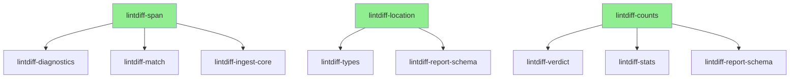
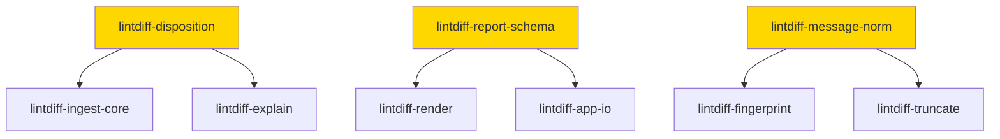
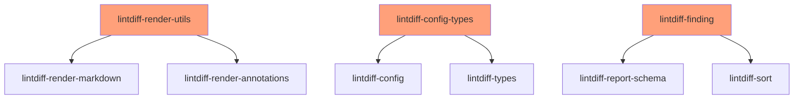

# Phase 3 Microcrate Expansion Plan

## Summary

This document analyzes the lintdiff codebase to identify additional SRP (Single Responsibility Principle) microcrate extraction opportunities for Phase 3, building on the 17 microcrates already extracted in Phases 1 and 2.

**Current State:**
- Phase 1: 9 microcrates (exit, stats, render-markdown, render-annotations, explain, truncate, config, escape, locale-detect)
- Phase 2: 8 microcrates (line-range, glob, severity, code-url, verdict, ci-env, path-norm, sort)
- Total: 36 crates

**Phase 3 Proposals:** 9 new microcrates identified across 3 priority tiers.

---

## High Priority

### 1. `lintdiff-span`

- **Purpose**: Source code span representation and selection
- **Source**: 
  - [`lintdiff-diagnostics/src/lib.rs:132`](crates/lintdiff-diagnostics/src/lib.rs:132) (`Span` struct)
  - [`lintdiff-match/src/spans.rs`](crates/lintdiff-match/src/spans.rs) (`select_spans` function)
- **API**:
  ```rust
  /// A source code location referenced by a diagnostic.
  #[derive(Clone, Debug)]
  pub struct Span {
      pub file: NormPath,
      pub line_start: u32,
      pub line_end: u32,
      pub col_start: Option<u32>,
      pub col_end: Option<u32>,
      pub is_primary: bool,
  }
  
  impl Span {
      /// Create a new span.
      pub fn new(file: NormPath, line_start: u32, line_end: u32) -> Self { ... }
      
      /// Check if this span contains a line.
      pub fn contains_line(&self, line: u32) -> bool { ... }
      
      /// Get the line range for this span.
      pub fn to_line_range(&self) -> LineRange { ... }
  }
  
  /// Select primary spans from a list.
  pub fn select_primary_spans(spans: &[Span]) -> Vec<&Span> { ... }
  
  /// Select the best span for matching (first primary, or first overall).
  pub fn select_best_span(spans: &[Span]) -> Option<&Span> { ... }
  ```
- **Rationale**: `Span` is a fundamental type used across diagnostics, matching, and ingest-core. Extracting it enables:
  - Independent versioning of span-related logic
  - Reuse in other tools that handle source locations
  - Clear separation between parsing (diagnostics) and selection (matching)

---

### 2. `lintdiff-location`

- **Purpose**: Report location type for findings
- **Source**: [`lintdiff-types/src/report.rs:115`](crates/lintdiff-types/src/report.rs:115)
- **API**:
  ```rust
  /// A location in source code for a finding.
  #[derive(Clone, Debug, Serialize, Deserialize)]
  pub struct Location {
      pub path: NormPath,
      #[serde(default, skip_serializing_if = "Option::is_none")]
      pub line: Option<u32>,
      #[serde(default, skip_serializing_if = "Option::is_none")]
      pub col: Option<u32>,
  }
  
  impl Location {
      /// Create a new location.
      pub fn new(path: NormPath, line: Option<u32>, col: Option<u32>) -> Self { ... }
      
      /// Create a file-only location.
      pub fn file_only(path: NormPath) -> Self { ... }
      
      /// Check if this location has line information.
      pub fn has_line(&self) -> bool { ... }
  }
  ```
- **Rationale**: `Location` is a protocol-stable type that appears in receipts. Extracting it:
  - Separates protocol types from domain logic
  - Enables stable versioning of receipt schema types
  - Reduces `lintdiff-types` to pure configuration types

---

### 3. `lintdiff-counts`

- **Purpose**: Severity counting utilities
- **Source**: 
  - [`lintdiff-types/src/report.rs:81`](crates/lintdiff-types/src/report.rs:81) (`Counts` struct)
  - [`lintdiff-policy/src/verdict.rs`](crates/lintdiff-policy/src/verdict.rs) (`counts_from_findings`)
- **API**:
  ```rust
  /// Severity counts for a collection of findings.
  #[derive(Clone, Debug, Default, Serialize, Deserialize)]
  pub struct Counts {
      pub info: u32,
      pub warn: u32,
      pub error: u32,
  }
  
  impl Counts {
      /// Get total count across all severities.
      pub fn total(&self) -> u32 { ... }
      
      /// Check if there are any errors.
      pub fn has_errors(&self) -> bool { ... }
      
      /// Check if there are any warnings or errors.
      pub fn has_issues(&self) -> bool { ... }
      
      /// Merge another counts into this one.
      pub fn merge(&mut self, other: &Counts) { ... }
  }
  
  /// Count findings by severity.
  pub fn count_by_severity<T>(items: &[T], severity_fn: impl Fn(&T) -> Severity) -> Counts { ... }
  ```
- **Rationale**: Counting logic is used in verdict computation, stats collection, and report generation. A dedicated crate:
  - Centralizes counting logic
  - Provides reusable counting utilities
  - Reduces code duplication

---

## Medium Priority

### 4. `lintdiff-disposition`

- **Purpose**: Diagnostic disposition tracking for explain output
- **Source**: [`lintdiff-types/src/report.rs:124`](crates/lintdiff-types/src/report.rs:124)
- **API**:
  ```rust
  /// Why a diagnostic was included or excluded from the report.
  #[derive(Clone, Debug, PartialEq, Eq, Serialize, Deserialize)]
  #[serde(rename_all = "snake_case")]
  pub enum Disposition {
      Included,
      DroppedNoSpan,
      DroppedOutsideDiff,
      DroppedByPathFilter,
      SuppressedByCode,
      CutByBudget,
  }
  
  /// Disposition of a single diagnostic through the ingest pipeline.
  #[derive(Clone, Debug, Serialize, Deserialize)]
  pub struct DiagnosticDisposition {
      pub code: String,
      pub message_preview: String,
      pub file: Option<String>,
      pub line: Option<u32>,
      pub disposition: Disposition,
      pub fingerprint: Option<String>,
  }
  
  /// Summary counters for the explain artifact.
  #[derive(Clone, Debug, Default, Serialize, Deserialize)]
  pub struct ExplainSummary {
      pub total: u32,
      pub included: u32,
      pub dropped_no_span: u32,
      pub dropped_outside_diff: u32,
      pub dropped_by_path_filter: u32,
      pub suppressed_by_code: u32,
      pub cut_by_budget: u32,
  }
  
  impl ExplainSummary {
      /// Build summary from dispositions.
      pub fn from_dispositions(dispositions: &[DiagnosticDisposition]) -> Self { ... }
  }
  ```
- **Rationale**: Disposition types are specific to the explain/debugging feature. Extracting them:
  - Isolates explain-specific logic
  - Makes `lintdiff-types` smaller and more focused
  - Enables independent evolution of explain feature

---

### 5. `lintdiff-report-schema`

- **Purpose**: Core report schema types for receipt generation
- **Source**: [`lintdiff-types/src/report.rs:1`](crates/lintdiff-types/src/report.rs:1)
- **API**:
  ```rust
  pub const SCHEMA_ID: &str = "lintdiff.report.v1";
  pub const TOOL_NAME: &str = "lintdiff";
  pub const CHECK_DIAGNOSTICS_ON_DIFF: &str = "diagnostics.on_diff";
  
  #[derive(Clone, Debug, Serialize, Deserialize)]
  pub struct Report {
      pub schema: String,
      pub tool: ToolInfo,
      pub run: RunInfo,
      pub verdict: Verdict,
      pub findings: Vec<Finding>,
      pub data: Option<Value>,
  }
  
  #[derive(Clone, Debug, Serialize, Deserialize)]
  pub struct ToolInfo { ... }
  
  #[derive(Clone, Debug, Serialize, Deserialize)]
  pub struct RunInfo { ... }
  
  #[derive(Clone, Debug, Serialize, Deserialize)]
  pub struct HostInfo { ... }
  
  #[derive(Clone, Debug, Serialize, Deserialize)]
  pub struct GitInfo { ... }
  
  #[derive(Clone, Debug, Serialize, Deserialize)]
  pub struct Verdict { ... }
  
  #[derive(Clone, Debug, Serialize, Deserialize)]
  pub enum VerdictStatus { ... }
  ```
- **Rationale**: Report schema types are protocol-stable and should be versioned independently. Extracting:
  - Creates a clear boundary for schema stability
  - Enables schema validation tools
  - Separates protocol from implementation

---

### 6. `lintdiff-message-norm`

- **Purpose**: Message text normalization for fingerprinting and display
- **Source**: [`lintdiff-fingerprint/src/lib.rs:151`](crates/lintdiff-fingerprint/src/lib.rs:151)
- **API**:
  ```rust
  /// Normalize message text for consistent fingerprinting.
  ///
  /// - Trims leading/trailing whitespace
  /// - Collapses internal whitespace to single spaces
  pub fn normalize_message(msg: &str) -> String { ... }
  
  /// Truncate a message to a maximum length with ellipsis.
  pub fn truncate_message(msg: &str, max_len: usize) -> String { ... }
  
  /// Preview a message for display in explain output.
  pub fn message_preview(msg: &str, max_len: usize) -> String { ... }
  ```
- **Rationale**: Message normalization is currently embedded in fingerprinting but is a reusable concern:
  - Could be used in display rendering
  - Could be used in explain output
  - Enables consistent message handling across the codebase

---

## Low Priority

### 7. `lintdiff-render-utils`

- **Purpose**: Shared rendering utility functions
- **Source**: [`lintdiff-render/src/lib.rs`](crates/lintdiff-render/src/lib.rs)
- **API**:
  ```rust
  /// Get a severity badge string for markdown.
  pub fn severity_badge(severity: &Severity) -> &'static str { ... }
  
  /// Format a location for display.
  pub fn format_location(loc: &Location) -> String { ... }
  
  /// Escape text for markdown table cells.
  pub fn escape_table(text: &str) -> String { ... }
  
  /// Escape text for GitHub workflow commands.
  pub fn escape_github_command(text: &str) -> String { ... }
  ```
- **Rationale**: These utilities are currently in `lintdiff-render` but could be shared:
  - Used by both markdown and annotations renderers
  - Could be used by external tools
  - Small, focused API

---

### 8. `lintdiff-config-types`

- **Purpose**: Configuration type definitions
- **Source**: [`lintdiff-types/src/config.rs`](crates/lintdiff-types/src/config.rs)
- **API**:
  ```rust
  #[derive(Clone, Debug, Serialize, Deserialize)]
  pub enum FailOn { Error, Warn, Never }
  
  #[derive(Clone, Debug, Serialize, Deserialize)]
  pub enum Profile { Default, Strict, Advisory }
  
  #[derive(Clone, Debug, Serialize, Deserialize)]
  pub struct FeatureFlags { ... }
  
  #[derive(Clone, Debug, Serialize, Deserialize)]
  pub struct FilterConfig { ... }
  
  #[derive(Clone, Debug, Serialize, Deserialize)]
  pub struct ProvenanceConfig { ... }
  
  #[derive(Clone, Debug, Serialize, Deserialize)]
  pub struct LintdiffConfig { ... }
  
  #[derive(Clone, Debug)]
  pub struct EffectiveConfig { ... }
  ```
- **Rationale**: Configuration types are a distinct concern from report types:
  - Currently mixed in `lintdiff-types`
  - Could be versioned independently
  - Enables config-only consumers

---

### 9. `lintdiff-finding`

- **Purpose**: Finding type and related utilities
- **Source**: [`lintdiff-types/src/report.rs:88`](crates/lintdiff-types/src/report.rs:88)
- **API**:
  ```rust
  /// A single lint finding.
  #[derive(Clone, Debug, Serialize, Deserialize)]
  pub struct Finding {
      pub severity: Severity,
      pub check_id: Option<String>,
      pub code: String,
      pub message: String,
      pub location: Option<Location>,
      pub help: Option<String>,
      pub url: Option<String>,
      pub fingerprint: Option<String>,
      pub data: Option<Value>,
  }
  
  impl Finding {
      /// Create a new finding with required fields.
      pub fn new(severity: Severity, code: impl Into<String>, message: impl Into<String>) -> Self { ... }
      
      /// Add location to the finding.
      pub fn with_location(mut self, location: Location) -> Self { ... }
      
      /// Add help text to the finding.
      pub fn with_help(mut self, help: impl Into<String>) -> Self { ... }
      
      /// Add URL to the finding.
      pub fn with_url(mut self, url: impl Into<String>) -> Self { ... }
  }
  ```
- **Rationale**: Finding is a core type that could benefit from dedicated utilities:
  - Builder pattern for construction
  - Validation methods
  - Independent versioning

---

## Implementation Order

### Phase 3A: Foundation Types



| Order | Crate | Dependencies | Impact |
|-------|-------|--------------|--------|
| 1 | `lintdiff-span` | NormPath, LineRange | High - fundamental type |
| 2 | `lintdiff-location` | NormPath | High - protocol type |
| 3 | `lintdiff-counts` | Severity | Medium - shared utility |

### Phase 3B: Schema Separation



| Order | Crate | Dependencies | Impact |
|-------|-------|--------------|--------|
| 4 | `lintdiff-disposition` | None | Medium - explain feature |
| 5 | `lintdiff-report-schema` | Multiple types | High - protocol stability |
| 6 | `lintdiff-message-norm` | None | Low - shared utility |

### Phase 3C: Refinements



| Order | Crate | Dependencies | Impact |
|-------|-------|--------------|--------|
| 7 | `lintdiff-render-utils` | Severity | Low - code organization |
| 8 | `lintdiff-config-types` | serde | Medium - cleaner separation |
| 9 | `lintdiff-finding` | Severity, Location | Low - builder utilities |

---

## Migration Strategy

### For Each New Microcrate

1. **Create the new crate** with `cargo new --lib crates/lintdiff-<name>`
2. **Copy code** from source crate to new crate
3. **Add tests** to ensure 100% coverage
4. **Update source crate** to re-export from new crate (backward compatibility)
5. **Update dependents** to use new crate directly
6. **Deprecate re-exports** in source crate after migration

### Backward Compatibility

All source crates will re-export the extracted types/functions:

```rust
// In lintdiff-types/src/lib.rs (after extracting lintdiff-location)
#[deprecated(since = "0.4.0", note = "Use lintdiff-location crate directly")]
pub use lintdiff_location::Location;
```

---

## Summary

| # | Crate | Priority | Est. Lines | Dependencies | Impact |
|---|-------|----------|------------|--------------|--------|
| 1 | `lintdiff-span` | High | ~80 | NormPath, LineRange | High |
| 2 | `lintdiff-location` | High | ~50 | NormPath | High |
| 3 | `lintdiff-counts` | High | ~60 | Severity | Medium |
| 4 | `lintdiff-disposition` | Medium | ~100 | None | Medium |
| 5 | `lintdiff-report-schema` | Medium | ~150 | Multiple | High |
| 6 | `lintdiff-message-norm` | Medium | ~40 | None | Low |
| 7 | `lintdiff-render-utils` | Low | ~60 | Severity | Low |
| 8 | `lintdiff-config-types` | Low | ~120 | serde | Medium |
| 9 | `lintdiff-finding` | Low | ~70 | Severity, Location | Low |

**Total new microcrates: 9**

**After Phase 3: 45 total crates**

---

## Key Insights from Analysis

### 1. `lintdiff-types` is Overloaded

The `lintdiff-types` crate currently contains:
- Configuration types (`config.rs`)
- Path normalization (`path.rs`)
- Report schema (`report.rs`)
- Ordering logic (`ordering.rs`)

Phase 2 extracted `line-range`, `path-norm`, and `sort`. Phase 3 should continue this decomposition by extracting `location`, `counts`, `disposition`, `report-schema`, `config-types`, and `finding`.

### 2. Protocol vs Implementation Types

A clear distinction emerges:
- **Protocol types**: `Report`, `Finding`, `Location`, `Verdict` - these appear in receipts and need stable versioning
- **Implementation types**: `Span`, `Diagnostic`, `DiffMap` - these are internal processing types

Extracting protocol types to `lintdiff-report-schema` creates a clear API boundary.

### 3. Explain Feature is Self-Contained

The disposition types (`Disposition`, `DiagnosticDisposition`, `ExplainSummary`) are only used for the explain/debug feature. Extracting them to `lintdiff-disposition`:
- Reduces `lintdiff-types` size
- Makes the explain feature optional in the future
- Enables independent testing

### 4. Span is a Fundamental Type

`Span` appears in:
- `lintdiff-diagnostics` (parsing)
- `lintdiff-match` (selection)
- `lintdiff-ingest-core` (transformation)

Extracting it enables each crate to depend on a common type without circular dependencies.

### 5. Message Normalization is Duplicated

The `truncate_message()` function in `lintdiff-ingest-core` duplicates functionality in `lintdiff-truncate`. A `lintdiff-message-norm` crate would:
- Centralize message handling
- Reduce code duplication
- Enable consistent behavior

---

## Recommendations

### Do Now (Phase 3A)
1. **`lintdiff-span`** - High impact, clear boundaries
2. **`lintdiff-location`** - Protocol stability
3. **`lintdiff-counts`** - Shared utility

### Do Soon (Phase 3B)
4. **`lintdiff-disposition`** - Clean up types
5. **`lintdiff-report-schema`** - Protocol boundary
6. **`lintdiff-message-norm`** - Reduce duplication

### Consider Later (Phase 3C)
7. **`lintdiff-render-utils`** - Nice to have
8. **`lintdiff-config-types`** - Cleaner organization
9. **`lintdiff-finding`** - Builder utilities
