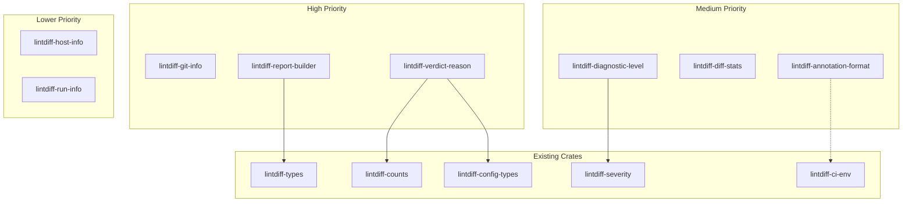

# Phase 5 Microcrate Expansion Plan

## Summary

This document analyzes the lintdiff codebase to identify additional SRP (Single Responsibility Principle) microcrate extraction opportunities for Phase 5, building on the 54 crates already established in Phases 1-4.

**Current State:**
- Phase 1: 9 microcrates (exit, stats, render-markdown, render-annotations, explain, truncate, config, escape, locale-detect)
- Phase 2: 8 microcrates (line-range, glob, severity, code-url, verdict, ci-env, path-norm, sort)
- Phase 3: 9 microcrates (span, location, counts, disposition, report-schema, message-norm, render-utils, config-types, finding)
- Phase 4: 8 microcrates (jsonl, hunk-header, code-norm, diff-paths, line-merge, timestamp, severity-map, explain-builder)
- **Total: 54 crates**

**Phase 5 Proposals:** 8 new microcrates identified across 3 priority tiers.

---

## High Priority

### 1. `lintdiff-git-info`

- **Purpose**: Git information handling and validation
- **Source**: 
  - [`lintdiff-types/src/report.rs:48-62`](crates/lintdiff-types/src/report.rs:48) (`GitInfo` struct)
  - [`lintdiff-app-git/src/lib.rs:80-120`](crates/lintdiff-app-git/src/lib.rs:80) (`gather_git_info`)
- **API**:
  ```rust
  /// Git repository information.
  #[derive(Clone, Debug, PartialEq, Eq, Serialize, Deserialize)]
  pub struct GitInfo {
      pub repo: Option<String>,
      pub base_ref: Option<String>,
      pub head_ref: Option<String>,
      pub base_sha: Option<String>,
      pub head_sha: Option<String>,
      pub merge_base: Option<String>,
  }
  
  impl GitInfo {
      /// Create from git commands in a repository.
      pub fn gather(repo_root: &Path) -> Result<Self, GitInfoError> { ... }
      
      /// Check if this represents a valid comparison.
      pub fn is_valid_comparison(&self) -> bool { ... }
      
      /// Get a short SHA for display.
      pub fn short_sha(&self) -> Option<&str> { ... }
      
      /// Validate SHA format.
      pub fn is_valid_sha(sha: &str) -> bool { ... }
  }
  
  /// Parse a git ref string.
  pub fn parse_git_ref(ref_str: &str) -> Option<GitRef> { ... }
  
  /// Validate a git SHA format.
  pub fn is_valid_sha(sha: &str) -> bool { ... }
  ```
- **Rationale**: Git information handling is a focused concern that:
  - Is used by app-git, types, and ingest-core
  - Has clear validation requirements
  - Can be tested independently with mock git output
  - SHA validation is reusable across the codebase
- **Dependencies**: None (or `serde` for serialization)
- **Estimated Tests**: 25-35

---

### 2. `lintdiff-report-builder`

- **Purpose**: Report construction and validation utilities
- **Source**: 
  - [`lintdiff-types/src/report.rs:10-20`](crates/lintdiff-types/src/report.rs:10) (`Report` struct)
  - [`lintdiff-ingest-core/src/lib.rs`](crates/lintdiff-ingest-core/src/lib.rs) (report construction logic)
- **API**:
  ```rust
  /// Builder for constructing reports.
  #[derive(Debug, Default)]
  pub struct ReportBuilder {
      tool: Option<ToolInfo>,
      run: Option<RunInfo>,
      verdict: Option<Verdict>,
      findings: Vec<Finding>,
      data: Option<Value>,
  }
  
  impl ReportBuilder {
      pub fn new() -> Self { ... }
      pub fn tool(mut self, tool: ToolInfo) -> Self { ... }
      pub fn run(mut self, run: RunInfo) -> Self { ... }
      pub fn verdict(mut self, verdict: Verdict) -> Self { ... }
      pub fn add_finding(mut self, finding: Finding) -> Self { ... }
      pub fn data(mut self, data: Value) -> Self { ... }
      pub fn build(self) -> Result<Report, ReportBuildError> { ... }
  }
  
  /// Validate a report schema.
  pub fn validate_schema(report: &Report) -> Result<(), SchemaError> { ... }
  
  /// Calculate report checksum for caching.
  pub fn report_checksum(report: &Report) -> String { ... }
  ```
- **Rationale**: Report construction is a complex operation that:
  - Has validation requirements
  - Benefits from builder pattern
  - Is used across multiple crates
  - Can be tested independently
- **Dependencies**: `lintdiff-types`, `serde_json`
- **Estimated Tests**: 30-40

---

### 3. `lintdiff-verdict-reason`

- **Purpose**: Verdict reason generation and formatting
- **Source**: 
  - [`lintdiff-policy/src/verdict.rs`](crates/lintdiff-policy/src/verdict.rs)
  - [`lintdiff-types/src/report.rs:69`](crates/lintdiff-types/src/report.rs:69) (`Verdict.reasons`)
- **API**:
  ```rust
  /// A reason for a verdict decision.
  #[derive(Debug, Clone, PartialEq, Eq)]
  pub struct VerdictReason {
      pub code: VerdictReasonCode,
      pub message: String,
      pub details: Option<String>,
  }
  
  #[derive(Debug, Clone, Copy, PartialEq, Eq)]
  pub enum VerdictReasonCode {
      NewErrors,
      NewWarnings,
      WarningThreshold,
      SuppressedOnly,
      NoNewIssues,
      BudgetExceeded,
      Custom,
  }
  
  impl VerdictReason {
      pub fn new_errors(count: u32) -> Self { ... }
      pub fn new_warnings(count: u32) -> Self { ... }
      pub fn warning_threshold(actual: u32, max: u32) -> Self { ... }
      pub fn no_new_issues() -> Self { ... }
      pub fn custom(message: impl Into<String>) -> Self { ... }
  }
  
  /// Generate verdict reasons from findings.
  pub fn generate_reasons(
      counts: &Counts,
      config: &EffectiveConfig,
  ) -> Vec<VerdictReason> { ... }
  ```
- **Rationale**: Verdict reason generation is a focused concern that:
  - Has clear formatting requirements
  - Is used for user communication
  - Can be tested independently
  - Improves error message consistency
- **Dependencies**: `lintdiff-counts`, `lintdiff-config-types`
- **Estimated Tests**: 20-30

---

## Medium Priority

### 4. `lintdiff-diagnostic-level`

- **Purpose**: Diagnostic level/severity parsing and conversion
- **Source**: 
  - [`lintdiff-diagnostics/src/lib.rs:93-105`](crates/lintdiff-diagnostics/src/lib.rs:93) (`DiagnosticLevel` enum)
  - [`lintdiff-policy/src/code.rs`](crates/lintdiff-policy/src/code.rs) (level mapping)
- **API**:
  ```rust
  /// Diagnostic severity level from compiler output.
  #[derive(Debug, Clone, Copy, PartialEq, Eq, Hash)]
  #[repr(u8)]
  pub enum DiagnosticLevel {
      Error,
      Warning,
      Note,
      Help,
  }
  
  impl DiagnosticLevel {
      /// Parse from rustc/clippy output string.
      pub fn parse(s: &str) -> Result<Self, DiagnosticLevelError> { ... }
      
      /// Convert to Severity for reports.
      pub fn to_severity(self) -> Severity { ... }
      
      /// Check if this is a blocking level.
      pub fn is_blocking(self, fail_on: FailOn) -> bool { ... }
      
      /// Get the icon for this level.
      pub fn icon(self) -> &'static str { ... }
  }
  
  /// Map a diagnostic level string to Severity.
  pub fn map_level_to_severity(level: &str) -> Severity { ... }
  ```
- **Rationale**: Diagnostic level handling is a focused concern that:
  - Is used by diagnostics parsing and policy
  - Has clear conversion rules
  - Can be tested with property tests
  - Reduces duplication between crates
- **Dependencies**: `lintdiff-severity`
- **Estimated Tests**: 20-25

---

### 5. `lintdiff-diff-stats`

- **Purpose**: Diff statistics aggregation and reporting
- **Source**: 
  - [`lintdiff-diff/src/lib.rs:43-51`](crates/lintdiff-diff/src/lib.rs:43) (`DiffStats` struct)
  - [`lintdiff-diff/src/lib.rs:231-234`](crates/lintdiff-diff/src/lib.rs:231) (stats accumulation)
- **API**:
  ```rust
  /// Statistics about a parsed diff.
  #[derive(Clone, Debug, Default, PartialEq, Eq)]
  pub struct DiffStats {
      pub files: u32,
      pub hunks: u32,
      pub added_lines: u32,
      pub removed_lines: u32,
      pub unchanged_lines: u32,
  }
  
  impl DiffStats {
      pub fn new() -> Self { ... }
      pub fn is_empty(&self) -> bool { ... }
      pub fn total_lines(&self) -> u32 { ... }
      pub fn add_file(&mut self) { ... }
      pub fn add_hunk(&mut self) { ... }
      pub fn add_line(&mut self, line_type: LineType) { ... }
      pub fn merge(&mut self, other: &DiffStats) { ... }
  }
  
  #[derive(Debug, Clone, Copy, PartialEq, Eq)]
  pub enum LineType {
      Added,
      Removed,
      Unchanged,
  }
  
  /// Calculate diff stats from a diff map.
  pub fn calculate_stats(diff_map: &DiffMap) -> DiffStats { ... }
  ```
- **Rationale**: Diff statistics is a focused concern that:
  - Is used for reporting and budgeting
  - Has clear aggregation rules
  - Can be tested independently
  - May be extended for more stats in future
- **Dependencies**: None
- **Estimated Tests**: 15-20

---

### 6. `lintdiff-annotation-format`

- **Purpose**: Annotation format handling and detection
- **Source**: 
  - [`lintdiff-app/src/lib.rs:38-42`](crates/lintdiff-app/src/lib.rs:38) (`AnnotationFormat` enum)
  - [`lintdiff-render/src/lib.rs:364`](crates/lintdiff-render/src/lib.rs:364) (annotation rendering)
- **API**:
  ```rust
  /// Output format for annotations.
  #[derive(Debug, Clone, Copy, PartialEq, Eq, Hash)]
  pub enum AnnotationFormat {
      Github,
      GitLab,
      AzureDevOps,
      None,
  }
  
  impl AnnotationFormat {
      /// Parse from string.
      pub fn parse(s: &str) -> Result<Self, AnnotationFormatError> { ... }
      
      /// Detect from CI environment.
      pub fn detect_from_env() -> Self { ... }
      
      /// Check if annotations are enabled.
      pub fn is_enabled(self) -> bool { ... }
      
      /// Get the format name for display.
      pub fn as_str(self) -> &'static str { ... }
  }
  
  /// Detect annotation format from environment.
  pub fn detect_annotation_format() -> AnnotationFormat { ... }
  ```
- **Rationale**: Annotation format handling is a focused concern that:
  - Is used by CLI and render crates
  - Has clear detection logic
  - Can be extended for more platforms
  - Improves CI integration
- **Dependencies**: `lintdiff-ci-env` (optional)
- **Estimated Tests**: 15-20

---

## Lower Priority

### 7. `lintdiff-host-info`

- **Purpose**: Host information detection and formatting
- **Source**: [`lintdiff-types/src/report.rs:42-46`](crates/lintdiff-types/src/report.rs:42) (`HostInfo` struct)
- **API**:
  ```rust
  /// Host system information.
  #[derive(Debug, Clone, PartialEq, Eq, Serialize, Deserialize)]
  pub struct HostInfo {
      pub os: String,
      pub arch: String,
  }
  
  impl HostInfo {
      /// Detect current host information.
      pub fn detect() -> Self { ... }
      
      /// Get the OS name.
      pub fn os(&self) -> &str { ... }
      
      /// Get the architecture.
      pub fn arch(&self) -> &str { ... }
      
      /// Check if running on CI.
      pub fn is_ci(&self) -> bool { ... }
  }
  
  /// Detect the current OS.
  pub fn detect_os() -> &'static str { ... }
  
  /// Detect the current architecture.
  pub fn detect_arch() -> &'static str { ... }
  ```
- **Rationale**: Host information is a small but reusable concern that:
  - Is used in reports
  - Has clear detection logic
  - Can be tested with mocks
  - May be extended for more details
- **Dependencies**: None
- **Estimated Tests**: 10-15

---

### 8. `lintdiff-run-info`

- **Purpose**: Run information and timing utilities
- **Source**: [`lintdiff-types/src/report.rs:30-40`](crates/lintdiff-types/src/report.rs:30) (`RunInfo` struct)
- **API**:
  ```rust
  /// Information about a lintdiff run.
  #[derive(Debug, Clone, PartialEq, Eq, Serialize, Deserialize)]
  pub struct RunInfo {
      pub started_at: String,
      pub ended_at: String,
      pub duration_ms: Option<u64>,
  }
  
  impl RunInfo {
      /// Create a new run info with current time.
      pub fn start() -> Self { ... }
      
      /// Mark the run as ended.
      pub fn end(&mut self) { ... }
      
      /// Calculate duration.
      pub fn duration(&self) -> Option<Duration> { ... }
      
      /// Format for display.
      pub fn format_duration(&self) -> String { ... }
  }
  
  /// Get current time as RFC3339 string.
  pub fn now_rfc3339() -> String { ... }
  
  /// Parse RFC3339 timestamp.
  pub fn parse_rfc3339(s: &str) -> Result<OffsetDateTime, TimeError> { ... }
  ```
- **Rationale**: Run information handling is a focused concern that:
  - Is used in reports
  - Has clear timing requirements
  - Can be tested independently
  - Improves timing accuracy
- **Dependencies**: `time` crate
- **Estimated Tests**: 15-20

---

## Summary Table

| Crate | Priority | Tests | Dependencies |
|-------|----------|-------|--------------|
| lintdiff-git-info | High | 25-35 | serde |
| lintdiff-report-builder | High | 30-40 | lintdiff-types, serde_json |
| lintdiff-verdict-reason | High | 20-30 | lintdiff-counts, lintdiff-config-types |
| lintdiff-diagnostic-level | Medium | 20-25 | lintdiff-severity |
| lintdiff-diff-stats | Medium | 15-20 | None |
| lintdiff-annotation-format | Medium | 15-20 | lintdiff-ci-env (optional) |
| lintdiff-host-info | Low | 10-15 | None |
| lintdiff-run-info | Low | 15-20 | time |

**Total Estimated Tests: 150-205**

---

## Dependency Graph



---

## Implementation Order

1. **lintdiff-git-info** - No dependencies on other Phase 5 crates
2. **lintdiff-diff-stats** - No dependencies, simple extraction
3. **lintdiff-diagnostic-level** - Only depends on existing lintdiff-severity
4. **lintdiff-verdict-reason** - Depends on existing crates only
5. **lintdiff-report-builder** - Depends on lintdiff-types
6. **lintdiff-annotation-format** - Optional dependency on lintdiff-ci-env
7. **lintdiff-host-info** - No dependencies
8. **lintdiff-run-info** - No dependencies on Phase 5 crates

---

## Testing Strategy

Each microcrate should include:

1. **Unit tests** for all public functions
2. **Property tests** where applicable (using proptest)
3. **Error case tests** for all error types
4. **Integration tests** for CI/CD integration
5. **Documentation tests** in doc comments

---

## Migration Path

1. Create new microcrate with API
2. Add tests (aim for 80%+ coverage)
3. Update dependent crates to use new microcrate
4. Remove duplicated code from source crates
5. Update workspace Cargo.toml
6. Run full test suite to verify no regressions

---

## Notes

- All crates should follow the existing naming convention: `lintdiff-<name>`
- Each crate should have a clear single responsibility
- Avoid circular dependencies
- Prefer small, focused APIs over large ones
- Document all public items with doc comments and examples
