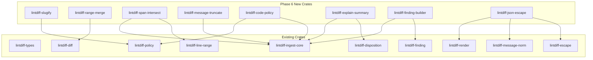

# Phase 6 Microcrate Expansion Plan

> Historical proposal. The collapse campaign superseded this expansion direction;
> use ADR-006 and the collapse ledger for current topology.

## Summary

This document analyzes the lintdiff codebase to identify additional SRP (Single Responsibility Principle) microcrate extraction opportunities for Phase 6, building on the ~62 crates already established in Phases 1-5.

**Current State:**
- Phase 1: 9 microcrates (exit, stats, render-markdown, render-annotations, explain, truncate, config, escape, locale-detect)
- Phase 2: 8 microcrates (line-range, glob, severity, code-url, verdict, ci-env, path-norm, sort)
- Phase 3: 9 microcrates (span, location, counts, disposition, report-schema, message-norm, render-utils, config-types, finding)
- Phase 4: 8 microcrates (jsonl, hunk-header, code-norm, diff-paths, line-merge, timestamp, severity-map, explain-builder)
- Phase 5: 8 microcrates (git-info, report-builder, verdict-reason, diagnostic-level, diff-stats, annotation-format, host-info, run-info)
- **Total: ~62 crates**

**Phase 6 Proposals:** 8 new microcrates identified across 3 priority tiers.

---

## High Priority

### 1. `lintdiff-slugify`

- **Purpose**: String slugification for diagnostic codes and URLs
- **Source**: 
  - [`lintdiff-policy/src/code.rs:55-70`](crates/lintdiff-policy/src/code.rs:55) (`slugify` function)
- **API**:
  ```rust
  /// Convert a string to a URL-friendly slug.
  ///
  /// - ASCII alphanumeric and underscore preserved
  /// - Colons converted to dots
  /// - Other characters converted to underscores
  /// - Consecutive dots collapsed
  /// - Leading/trailing dots removed
  #[must_use]
  pub fn slugify(s: &str) -> String { ... }
  
  /// Slugify with custom replacement character.
  #[must_use]
  pub fn slugify_with(s: &str, replacement: char) -> String { ... }
  
  /// Check if a string is already slugified.
  #[must_use]
  pub fn is_slugified(s: &str) -> bool { ... }
  ```
- **Rationale**: The `slugify` function is a focused utility that:
  - Is used for converting diagnostic codes to URL-friendly format
  - Has clear, testable behavior
  - Is reusable across code normalization and URL generation
  - Has no external dependencies
- **Dependencies**: None
- **Estimated Tests**: 20-30
- **Migration**: Extract from `lintdiff-policy`, update `lintdiff-policy` to depend on new crate

---

### 2. `lintdiff-range-merge`

- **Purpose**: Merge adjacent/consecutive numbers into ranges
- **Source**: 
  - [`lintdiff-diff/src/lib.rs:293-325`](crates/lintdiff-diff/src/lib.rs:293) (`merge_lines_to_ranges`)
- **API**:
  ```rust
  /// Merge a sorted list of line numbers into contiguous ranges.
  ///
  /// # Example
  /// ```
  /// use lintdiff_range_merge::merge_to_ranges;
  /// 
  /// let lines = vec![1, 2, 3, 5, 6, 8];
  /// let ranges = merge_to_ranges(lines);
  /// // Returns: [(1,3), (5,6), (8,8)]
  /// ```
  #[must_use]
  pub fn merge_to_ranges(lines: Vec<u32>) -> Vec<Range<u32>> { ... }
  
  /// Merge with custom gap threshold (allow N-1 gap between items).
  #[must_use]
  pub fn merge_to_ranges_with_gap(lines: Vec<u32>, max_gap: u32) -> Vec<Range<u32>> { ... }
  
  /// Expand ranges back to individual line numbers.
  #[must_use]
  pub fn expand_ranges(ranges: &[Range<u32>]) -> Vec<u32> { ... }
  ```
- **Rationale**: Range merging is a focused algorithm that:
  - Is used in diff parsing to compact changed line numbers
  - Has well-defined mathematical properties
  - Is highly testable with property-based tests
  - Could be reused in other contexts (annotation batching, etc.)
- **Dependencies**: None
- **Estimated Tests**: 25-35
- **Migration**: Extract from `lintdiff-diff`, update `lintdiff-diff` to depend on new crate

---

### 3. `lintdiff-span-intersect`

- **Purpose**: Line range intersection detection
- **Source**: 
  - [`lintdiff-types/src/path.rs:92-98`](crates/lintdiff-types/src/path.rs:92) (`LineRange::intersects`)
  - [`lintdiff-ingest-core/src/lib.rs:178-183`](crates/lintdiff-ingest-core/src/lib.rs:178) (intersection logic)
- **API**:
  ```rust
  /// Check if two line ranges intersect.
  #[must_use]
  pub fn ranges_intersect(a: &LineRange, b: &LineRange) -> bool { ... }
  
  /// Find the intersection of two ranges.
  #[must_use]
  pub fn range_intersection(a: &LineRange, b: &LineRange) -> Option<LineRange> { ... }
  
  /// Check if a line is within any of the given ranges.
  #[must_use]
  pub fn line_in_ranges(line: u32, ranges: &[LineRange]) -> bool { ... }
  
  /// Find which ranges contain a given line.
  #[must_use]
  pub fn find_containing_ranges(line: u32, ranges: &[LineRange]) -> Vec<usize> { ... }
  ```
- **Rationale**: Range intersection is a focused geometric operation that:
  - Is core to matching diagnostics to diff ranges
  - Has clear mathematical properties
  - Is highly testable
  - Could support optimized spatial indexing in the future
- **Dependencies**: `lintdiff-line-range` (or inline `LineRange` type)
- **Estimated Tests**: 30-40
- **Migration**: Create new crate, update `lintdiff-ingest-core` to use it

---

## Medium Priority

### 4. `lintdiff-message-truncate`

- **Purpose**: Unicode-aware message truncation with ellipsis
- **Source**: 
  - [`lintdiff-ingest-core/src/lib.rs:401-415`](crates/lintdiff-ingest-core/src/lib.rs:401) (`truncate_message`)
- **API**:
  ```rust
  /// Truncate a message to a maximum byte length, respecting UTF-8 boundaries.
  ///
  /// # Example
  /// ```
  /// use lintdiff_message_truncate::truncate_message;
  /// 
  /// let truncated = truncate_message("hello world", 5);
  /// assert_eq!(truncated, "hello...");
  /// ```
  #[must_use]
  pub fn truncate_message(msg: &str, max_len: usize) -> String { ... }
  
  /// Truncate with custom ellipsis.
  #[must_use]
  pub fn truncate_message_with(msg: &str, max_len: usize, ellipsis: &str) -> String { ... }
  
  /// Truncate at word boundary when possible.
  #[must_use]
  pub fn truncate_at_word(msg: &str, max_len: usize) -> String { ... }
  ```
- **Rationale**: Message truncation is distinct from general truncation because:
  - It must respect UTF-8 character boundaries
  - It's used specifically for diagnostic message previews
  - Different from `lintdiff-truncate` which focuses on line/file truncation
  - The `lintdiff-message-norm` crate already has similar functionality that could be consolidated
- **Dependencies**: None
- **Estimated Tests**: 25-35
- **Migration**: Extract from `lintdiff-ingest-core`, consider consolidating with `lintdiff-message-norm`

---

### 5. `lintdiff-code-policy`

- **Purpose**: Code allow/deny/suppress policy evaluation
- **Source**: 
  - [`lintdiff-policy/src/code.rs:72-80`](crates/lintdiff-policy/src/code.rs:72) (`is_code_allowed`)
  - [`lintdiff-ingest-core/src/lib.rs:222-240`](crates/lintdiff-ingest-core/src/lib.rs:222) (code policy application)
- **API**:
  ```rust
  /// Policy for diagnostic code handling.
  #[derive(Debug, Clone, Default)]
  pub struct CodePolicy {
      pub allow_codes: Vec<String>,
      pub suppress_codes: Vec<String>,
      pub deny_codes: Vec<String>,
  }
  
  impl CodePolicy {
      /// Check if a code is allowed (not suppressed).
      pub fn is_allowed(&self, code: &str) -> bool { ... }
      
      /// Check if a code should be upgraded to error.
      pub fn is_denied(&self, code: &str) -> bool { ... }
      
      /// Evaluate policy for a code, returning the action.
      pub fn evaluate(&self, code: &str) -> CodeAction { ... }
  }
  
  #[derive(Debug, Clone, Copy, PartialEq, Eq)]
  pub enum CodeAction {
      Allow,
      Suppress,
      Deny,
  }
  ```
- **Rationale**: Code policy evaluation is a focused concern that:
  - Has clear business rules
  - Is separate from diagnostic code normalization
  - Is testable in isolation
  - Could be extended with more complex rules (patterns, severity-based)
- **Dependencies**: None
- **Estimated Tests**: 20-30
- **Migration**: Extract from `lintdiff-policy`, update `lintdiff-policy` and `lintdiff-ingest-core`

---

### 6. `lintdiff-explain-summary`

- **Purpose**: Build explain artifact summaries from dispositions
- **Source**: 
  - [`lintdiff-ingest-core/src/lib.rs:383-398`](crates/lintdiff-ingest-core/src/lib.rs:383) (`build_explain_summary`)
  - [`lintdiff-types/src/report.rs:150-161`](crates/lintdiff-types/src/report.rs:150) (`ExplainSummary`)
- **API**:
  ```rust
  /// Summary of diagnostic dispositions.
  #[derive(Debug, Clone, Default, Serialize)]
  pub struct ExplainSummary {
      pub total: u32,
      pub included: u32,
      pub dropped_no_span: u32,
      pub dropped_outside_diff: u32,
      pub dropped_by_path_filter: u32,
      pub suppressed_by_code: u32,
      pub cut_by_budget: u32,
  }
  
  impl ExplainSummary {
      /// Create from a slice of dispositions.
      pub fn from_dispositions(dispositions: &[DiagnosticDisposition]) -> Self { ... }
      
      /// Merge another summary into this one.
      pub fn merge(&mut self, other: &ExplainSummary) { ... }
      
      /// Check if any diagnostics were filtered.
      pub fn has_filtered(&self) -> bool { ... }
  }
  ```
- **Rationale**: Explain summary building is a focused aggregation that:
  - Has clear semantics
  - Is used for reporting and debugging
  - Is testable in isolation
  - Could be extended with more detailed breakdowns
- **Dependencies**: `lintdiff-disposition`
- **Estimated Tests**: 15-25
- **Migration**: Extract from `lintdiff-ingest-core` and `lintdiff-types`

---

## Lower Priority

### 7. `lintdiff-finding-builder`

- **Purpose**: Builder pattern for constructing Finding instances
- **Source**: 
  - [`lintdiff-ingest-core/src/lib.rs:417-429`](crates/lintdiff-ingest-core/src/lib.rs:417) (`tool_error_finding`)
  - [`lintdiff-ingest-core/src/lib.rs:260-281`](crates/lintdiff-ingest-core/src/lib.rs:260) (finding construction)
- **API**:
  ```rust
  /// Builder for constructing Finding instances.
  #[derive(Debug, Default)]
  pub struct FindingBuilder {
      severity: Option<Severity>,
      check_id: Option<String>,
      code: Option<String>,
      message: Option<String>,
      location: Option<Location>,
      help: Option<String>,
      url: Option<String>,
      fingerprint: Option<String>,
      data: Option<Value>,
  }
  
  impl FindingBuilder {
      pub fn new() -> Self { ... }
      pub fn severity(mut self, severity: Severity) -> Self { ... }
      pub fn code(mut self, code: impl Into<String>) -> Self { ... }
      pub fn message(mut self, msg: impl Into<String>) -> Self { ... }
      pub fn location(mut self, loc: Location) -> Self { ... }
      pub fn help(mut self, help: impl Into<String>) -> Self { ... }
      pub fn url(mut self, url: impl Into<String>) -> Self { ... }
      pub fn fingerprint(mut self, fp: impl Into<String>) -> Self { ... }
      pub fn data(mut self, data: Value) -> Self { ... }
      pub fn build(self) -> Result<Finding, FindingBuildError> { ... }
      
      /// Create a tool error finding (convenience method).
      pub fn tool_error(code: &str, msg: &str) -> Finding { ... }
  }
  ```
- **Rationale**: Finding construction is verbose and error-prone:
  - Many optional fields
  - Common patterns repeated
  - Builder pattern improves readability
  - Validation can be centralized
- **Dependencies**: `lintdiff-finding`, `lintdiff-types`
- **Estimated Tests**: 20-30
- **Migration**: Create new crate, update `lintdiff-ingest-core` to use builder

---

### 8. `lintdiff-json-escape`

- **Purpose**: JSON string escaping utilities
- **Source**: 
  - [`lintdiff-render/src/lib.rs:426-432`](crates/lintdiff-render/src/lib.rs:426) (`escape_github_command`)
  - [`lintdiff-message-norm/src/lib.rs:388-465`](crates/lintdiff-message-norm/src/lib.rs:388) (`escape_json`, `escape_html`)
  - [`lintdiff-escape/src/lib.rs:300-340`](crates/lintdiff-escape/src/lib.rs:300) (`escape_json`)
- **API**:
  ```rust
  /// Escape a string for embedding in JSON.
  #[must_use]
  pub fn escape_json_string(s: &str) -> Cow<'_, str> { ... }
  
  /// Escape for GitHub Actions workflow commands.
  /// - `%` → `%25`
  /// - `\r` → `%0D`
  /// - `\n` → `%0A`
  #[must_use]
  pub fn escape_github_command(s: &str) -> String { ... }
  
  /// Escape for GitHub Actions annotation messages.
  /// - `%` → `%25`
  /// - `\r` → `%0D`
  /// - `\n` → `%0A`
  /// - `:` → `%3A`
  /// - `,` → `%2C`
  #[must_use]
  pub fn escape_github_annotation(s: &str) -> String { ... }
  
  /// Check if a string needs JSON escaping.
  #[must_use]
  pub fn needs_json_escaping(s: &str) -> bool { ... }
  ```
- **Rationale**: JSON/command escaping is scattered across crates:
  - `lintdiff-render` has GitHub command escaping
  - `lintdiff-message-norm` has JSON/HTML escaping
  - `lintdiff-escape` has JSON escaping
  - Consolidation would reduce duplication
- **Dependencies**: None
- **Estimated Tests**: 30-40
- **Migration**: Consolidate from multiple crates, update dependents

---

## Dependency Graph



---

## Migration Strategy

### Phase 6.1: High Priority (3 crates)
1. `lintdiff-slugify` - Extract from `lintdiff-policy`
2. `lintdiff-range-merge` - Extract from `lintdiff-diff`
3. `lintdiff-span-intersect` - New crate, update `lintdiff-ingest-core`

### Phase 6.2: Medium Priority (3 crates)
4. `lintdiff-message-truncate` - Extract from `lintdiff-ingest-core`
5. `lintdiff-code-policy` - Extract from `lintdiff-policy`
6. `lintdiff-explain-summary` - Extract from `lintdiff-ingest-core` and `lintdiff-types`

### Phase 6.3: Lower Priority (2 crates)
7. `lintdiff-finding-builder` - New crate
8. `lintdiff-json-escape` - Consolidate from multiple crates

---

## Testing Strategy

Each microcrate should include:

1. **Unit Tests**: Core functionality tests
2. **Property-Based Tests**: Using proptest for edge cases
3. **Documentation Tests**: Examples in doc comments
4. **Edge Case Tests**: Empty inputs, Unicode, boundary conditions

### Test Count Estimates

| Crate | Unit Tests | Property Tests | Doc Tests | Total |
|-------|------------|----------------|-----------|-------|
| lintdiff-slugify | 15 | 5 | 5 | 25 |
| lintdiff-range-merge | 15 | 10 | 5 | 30 |
| lintdiff-span-intersect | 20 | 10 | 5 | 35 |
| lintdiff-message-truncate | 15 | 10 | 5 | 30 |
| lintdiff-code-policy | 15 | 5 | 5 | 25 |
| lintdiff-explain-summary | 15 | 5 | 5 | 25 |
| lintdiff-finding-builder | 20 | 5 | 5 | 30 |
| lintdiff-json-escape | 20 | 10 | 5 | 35 |
| **Total** | **135** | **60** | **40** | **235** |

---

## Risk Assessment

### Low Risk
- `lintdiff-slugify`: Simple, pure function with no dependencies
- `lintdiff-range-merge`: Well-defined algorithm, easy to test
- `lintdiff-span-intersect`: Clear semantics, mathematical foundation

### Medium Risk
- `lintdiff-message-truncate`: May overlap with existing truncate functionality
- `lintdiff-code-policy`: Business logic that may need extension
- `lintdiff-explain-summary`: Depends on disposition types

### Higher Risk
- `lintdiff-finding-builder`: Many fields, validation complexity
- `lintdiff-json-escape`: Consolidation may break existing behavior

---

## Success Criteria

1. **Test Coverage**: Each crate achieves >90% coverage
2. **Documentation**: All public APIs have doc examples
3. **No Regressions**: All existing tests pass after migration
4. **Clean Dependencies**: No circular dependencies introduced
5. **Build Time**: No significant increase in compile time

---

## Conclusion

Phase 6 proposes 8 new microcrates focusing on:

1. **String Utilities**: slugify, json-escape
2. **Algorithm Extraction**: range-merge, span-intersect
3. **Domain Logic**: code-policy, explain-summary
4. **Builder Patterns**: finding-builder
5. **Message Handling**: message-truncate

These extractions will:
- Improve testability through focused, single-responsibility crates
- Reduce code duplication across the codebase
- Enable better reuse of utility functions
- Make the codebase more maintainable and easier to understand

Total estimated test count: **235+ new tests**
