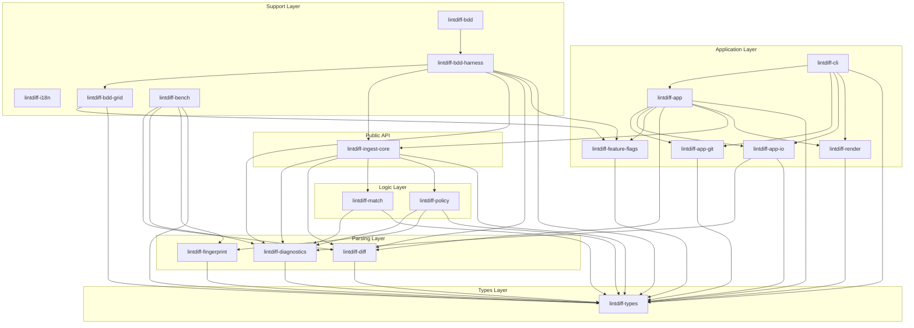

# Microcrate Architecture Review

**Review Date**: 2026-03-25  
**Reviewer**: Architect Mode  
**Scope**: Completeness and consistency analysis of lintdiff microcrate architecture

---

## Executive Summary

The lintdiff project follows a well-structured microcrate workspace architecture with clear separation of concerns. The architecture is largely consistent with documentation, but several crates are missing from the documented architecture diagram, and one crate ([`lintdiff-app`](crates/lintdiff-app)) lacks dedicated tests.

**Overall Assessment**: ✅ **Good** - Architecture is sound with minor documentation gaps

---

## 1. Workspace Structure Analysis

### 1.1 Current Workspace Members (21 crates)

| Category | Crates |
|----------|--------|
| **Core Pipeline** | `lintdiff-types`, `lintdiff-diagnostics`, `lintdiff-diff`, `lintdiff-match`, `lintdiff-policy`, `lintdiff-fingerprint`, `lintdiff-ingest-core` |
| **Application Layer** | `lintdiff-app`, `lintdiff-app-git`, `lintdiff-app-io`, `lintdiff-cli` |
| **Rendering** | `lintdiff-render` |
| **Feature Support** | `lintdiff-feature-flags`, `lintdiff-i18n` |
| **Testing** | `lintdiff-bdd`, `lintdiff-bdd-harness`, `lintdiff-bdd-grid` |
| **Benchmarking** | `lintdiff-bench` |
| **Removed (v1.0.0)** | ~~`lintdiff-domain`~~, ~~`lintdiff-core`~~, ~~`lintdiff-ingest`~~ |

### 1.2 Documented vs Actual Architecture

#### Crates in Documented Architecture Diagram
```
lintdiff-cli          (Binary only)         ✅ Present
    │
    ▼
lintdiff-app          (Orchestration)       ✅ Present
    │
    ├──► lintdiff-app-git      (Git adapter)    ✅ Present
    ├──► lintdiff-app-io       (I/O adapter)    ✅ Present
    ├──► lintdiff-feature-flags (Feature-flag)  ✅ Present
    ├──► lintdiff-diff         (Unified diff)   ✅ Present
    ├──► lintdiff-ingest-core  (Public API)     ✅ Present
    │        ├──► lintdiff-match       ✅ Present
    │        └──► lintdiff-policy      ✅ Present
    ├──► lintdiff-fingerprint  (Fingerprint)    ✅ Present
    ├──► lintdiff-render       (Render)         ✅ Present
    └──► lintdiff-types        (DTOs)           ✅ Present
```

#### Crates Missing from Documented Architecture

| Crate | Purpose | Status |
|-------|---------|--------|
| [`lintdiff-diagnostics`](crates/lintdiff-diagnostics) | Cargo JSON diagnostics parsing | ⚠️ **Not documented** |
| [`lintdiff-bdd`](crates/lintdiff-bdd) | BDD test helpers | ⚠️ **Not documented** |
| [`lintdiff-bdd-harness`](crates/lintdiff-bdd-harness) | Fixture harness | ⚠️ **Not documented** |
| [`lintdiff-bdd-grid`](crates/lintdiff-bdd-grid) | Scenario-grid primitives | ⚠️ **Not documented** |
| [`lintdiff-bench`](crates/lintdiff-bench) | Performance benchmarks | ⚠️ **Not documented** |
| [`lintdiff-i18n`](crates/lintdiff-i18n) | Internationalization | ⚠️ **Not documented** |

#### Removed Crates (v1.0.0)

| Crate | Façade Chain | Status |
|-------|--------------|--------|
| ~~`lintdiff-domain`~~ | → `lintdiff-core` | ✅ Removed in v1.0.0 (2026-03-25) |
| ~~`lintdiff-core`~~ | → `lintdiff-ingest` | ✅ Removed in v1.0.0 (2026-03-25) |
| ~~`lintdiff-ingest`~~ | → `lintdiff-ingest-core` | ✅ Removed in v1.0.0 (2026-03-25) |

---

## 2. Dependency Analysis

### 2.1 Dependency Graph



### 2.2 Dependency Verification Results

| Crate | Expected Dependencies | Actual Dependencies | Status |
|-------|----------------------|---------------------|--------|
| `lintdiff-types` | None (leaf) | External only | ✅ Correct |
| `lintdiff-diagnostics` | `lintdiff-types` | `lintdiff-types` | ✅ Correct |
| `lintdiff-diff` | `lintdiff-types` | `lintdiff-types` | ✅ Correct |
| `lintdiff-fingerprint` | `lintdiff-types` | `lintdiff-types` | ✅ Correct |
| `lintdiff-match` | `lintdiff-diagnostics`, `lintdiff-types` | `lintdiff-diagnostics`, `lintdiff-types` | ✅ Correct |
| `lintdiff-policy` | `lintdiff-diagnostics`, `lintdiff-fingerprint`, `lintdiff-types` | `lintdiff-diagnostics`, `lintdiff-fingerprint`, `lintdiff-types` | ✅ Correct |
| `lintdiff-ingest-core` | All parsing/logic crates | `diagnostics`, `diff`, `match`, `policy`, `types` | ✅ Correct |
| `lintdiff-app` | All adapters + core | `app-git`, `app-io`, `feature-flags`, `diff`, `ingest-core`, `render`, `types` | ✅ Correct |
| `lintdiff-cli` | `lintdiff-app` + adapters | `app`, `app-git`, `app-io`, `render`, `types` | ✅ Correct |

### 2.3 Circular Dependencies

**Result**: ✅ **No circular dependencies detected**

The dependency graph forms a clean directed acyclic graph (DAG) with proper layering.

---

## 3. Crate Completeness

### 3.1 Test Coverage Summary

| Crate | Unit Tests | Integration Tests | Property Tests | Status |
|-------|------------|-------------------|----------------|--------|
| `lintdiff-types` | ✅ | ✅ schema validation | ❌ | ✅ Good |
| `lintdiff-diagnostics` | ✅ | ✅ | ❌ | ✅ Good |
| `lintdiff-diff` | ✅ | ✅ | ✅ proptest | ✅ Excellent |
| `lintdiff-fingerprint` | ✅ | ✅ stability | ❌ | ✅ Good |
| `lintdiff-match` | ✅ | ✅ | ❌ | ✅ Good |
| `lintdiff-policy` | ✅ | ✅ | ❌ | ✅ Good |
| `lintdiff-ingest-core` | ✅ | ✅ snapshots | ❌ | ✅ Good |
| `lintdiff-render` | ✅ | ✅ | ❌ | ✅ Good |
| `lintdiff-app-git` | ❌ | ✅ | ❌ | ✅ Acceptable |
| `lintdiff-app-io` | ❌ | ✅ | ❌ | ✅ Acceptable |
| `lintdiff-feature-flags` | ✅ | ✅ | ❌ | ✅ Good |
| `lintdiff-i18n` | ✅ | ❌ | ❌ | ⚠️ Needs integration tests |
| `lintdiff-app` | ❌ | ❌ | ❌ | ❌ **Missing tests** |
| `lintdiff-cli` | ❌ | ✅ BDD | ❌ | ✅ Good |
| `lintdiff-bdd-grid` | ✅ | ❌ | ❌ | ✅ Good |
| `lintdiff-bdd-harness` | ✅ | ❌ | ❌ | ✅ Good |
| `lintdiff-bench` | N/A | N/A | N/A | ✅ Benchmark only |

### 3.2 Documentation Summary

| Crate | Crate Docs | Deprecation Notice | Status |
|-------|------------|-------------------|--------|
| `lintdiff-types` | ✅ | N/A | ✅ |
| `lintdiff-diagnostics` | ✅ | N/A | ✅ |
| `lintdiff-diff` | ✅ | N/A | ✅ |
| `lintdiff-fingerprint` | ✅ | N/A | ✅ |
| `lintdiff-match` | ✅ | N/A | ✅ |
| `lintdiff-policy` | ✅ | N/A | ✅ |
| `lintdiff-ingest-core` | ✅ | N/A | ✅ |
| `lintdiff-render` | ✅ | N/A | ✅ |
| `lintdiff-app-git` | ✅ | N/A | ✅ |
| `lintdiff-app-io` | ✅ | N/A | ✅ |
| `lintdiff-feature-flags` | ✅ | N/A | ✅ |
| `lintdiff-i18n` | ✅ | N/A | ✅ |
| `lintdiff-app` | ✅ | N/A | ✅ |
| `lintdiff-cli` | ✅ | N/A | ✅ |
| ~~`lintdiff-domain`~~ | ✅ | ✅ Removed in v1.0.0 | ✅ |
| ~~`lintdiff-core`~~ | ✅ | ✅ Removed in v1.0.0 | ✅ |
| ~~`lintdiff-ingest`~~ | ✅ | ✅ Removed in v1.0.0 | ✅ |

### 3.3 Cargo.toml Metadata

All crates include proper workspace metadata:
- ✅ `version.workspace = true`
- ✅ `edition.workspace = true`
- ✅ `license.workspace = true`
- ✅ `rust-version.workspace = true`
- ✅ `authors.workspace = true`
- ✅ `repository.workspace = true`
- ✅ `description` (crate-specific)
- ✅ `keywords.workspace = true`
- ✅ `categories.workspace = true`

---

## 4. Findings and Recommendations

### 4.1 Critical Issues

**None identified** - The architecture is sound and follows hexagonal architecture principles.

### 4.2 High Priority

#### H1: Missing Tests for `lintdiff-app`

**Issue**: The [`lintdiff-app`](crates/lintdiff-app) crate has no dedicated test directory.

**Impact**: Orchestration logic is not directly tested; relies on CLI BDD tests for coverage.

**Recommendation**: Add integration tests for:
- Pipeline orchestration
- Error handling paths
- Adapter coordination

```rust
// Suggested: crates/lintdiff-app/tests/orchestration_tests.rs
```

### 4.3 Medium Priority

#### M1: Update Architecture Documentation

**Issue**: Six crates are missing from [`docs/architecture.md`](docs/architecture.md):
- `lintdiff-diagnostics`
- `lintdiff-bdd`, `lintdiff-bdd-harness`, `lintdiff-bdd-grid`
- `lintdiff-bench`
- `lintdiff-i18n`

**Recommendation**: Update the architecture diagram to include all crates:

```
┌─────────────────────────────────────────────────────────────────┐
│                     Public API Surface                           │
│  ┌─────────────────────────────────────────────────────────┐    │
│  │              lintdiff-ingest-core                        │    │
│  │   (IngestPipeline, Policy, Verdict, Finding, Report)    │    │
│  └─────────────────────────────────────────────────────────┘    │
└─────────────────────────────────────────────────────────────────┘
                              │
                              ▼
┌─────────────────────────────────────────────────────────────────┐
│                      Internal Crates                             │
│  ┌──────────────┐ ┌──────────────┐ ┌──────────────┐             │
│  │lintdiff-types│ │lintdiff-diag │ │ lintdiff-diff│             │
│  └──────────────┘ └──────────────┘ └──────────────┘             │
│  ┌──────────────┐ ┌──────────────┐ ┌──────────────┐             │
│  │lintdiff-match│ │lintdiff-fp   │ │lintdiff-render│            │
│  └──────────────┘ └──────────────┘ └──────────────┘             │
│  ┌──────────────┐ ┌──────────────┐                               │
│  │lintdiff-policy│ │lintdiff-i18n│                               │
│  └──────────────┘ └──────────────┘                               │
└─────────────────────────────────────────────────────────────────┘
                              │
                              ▼
┌─────────────────────────────────────────────────────────────────┐
│                      Application Layer                           │
│  ┌──────────────┐ ┌──────────────┐ ┌──────────────┐             │
│  │ lintdiff-app │ │lintdiff-app-io│ │lintdiff-app-git│          │
│  └──────────────┘ └──────────────┘ └──────────────┘             │
│  ┌──────────────┐ ┌──────────────┐                               │
│  │lintdiff-ff   │ │ lintdiff-cli │                               │
│  └──────────────┘ └──────────────┘                               │
└─────────────────────────────────────────────────────────────────┘
                              │
                              ▼
┌─────────────────────────────────────────────────────────────────┐
│                      Testing & Support                           │
│  ┌──────────────┐ ┌──────────────┐ ┌──────────────┐             │
│  │ lintdiff-bdd │ │lintdiff-bdd- │ │lintdiff-bdd- │             │
│  │              │ │   harness    │ │    grid      │             │
│  └──────────────┘ └──────────────┘ └──────────────┘             │
│  ┌──────────────┐                                                │
│  │lintdiff-bench│                                                │
│  └──────────────┘                                                │
└─────────────────────────────────────────────────────────────────┘
```

#### M2: Add Integration Tests for `lintdiff-i18n`

**Issue**: [`lintdiff-i18n`](crates/lintdiff-i18n) has only unit tests, no integration tests.

**Recommendation**: Add integration tests for:
- Locale loading and fallback
- Message formatting with variables
- Error handling for missing translations

### 4.4 Low Priority

#### L1: Document Testing Crates in Architecture

**Issue**: The BDD testing crates are mentioned in the contracts section but not in the architecture diagram.

**Recommendation**: Add a "Testing Layer" section to [`docs/architecture.md`](docs/architecture.md).

#### L2: Consider Merging `lintdiff-bdd` into `lintdiff-bdd-harness`

**Issue**: [`lintdiff-bdd`](crates/lintdiff-bdd) is a thin façade that only re-exports [`lintdiff-bdd-harness`](crates/lintdiff-bdd-harness).

**Recommendation**: Evaluate if this façade provides value or should be consolidated.

---

## 5. Hexagonal Architecture Compliance

### 5.1 Layer Verification

| Layer | Crates | Dependency Direction | Status |
|-------|--------|---------------------|--------|
| **Domain/Types** | `lintdiff-types` | Inward only (no deps) | ✅ |
| **Parsing** | `lintdiff-diagnostics`, `lintdiff-diff` | → Types | ✅ |
| **Logic** | `lintdiff-match`, `lintdiff-policy`, `lintdiff-fingerprint` | → Parsing, Types | ✅ |
| **Core/Ingest** | `lintdiff-ingest-core` | → Logic, Parsing, Types | ✅ |
| **Adapters** | `lintdiff-app-git`, `lintdiff-app-io` | → Core, Types | ✅ |
| **Application** | `lintdiff-app` | → Adapters, Core | ✅ |
| **Interface** | `lintdiff-cli` | → Application | ✅ |

### 5.2 Port/Adapter Pattern

The architecture correctly implements the hexagonal pattern:
- **Ports**: Defined in `lintdiff-types` (interfaces/traits)
- **Adapters**: `lintdiff-app-git`, `lintdiff-app-io` implement external integrations
- **Core**: `lintdiff-ingest-core` contains business logic with no external dependencies

---

## 6. Summary

### 6.1 Architecture Health Metrics

| Metric | Value | Target | Status |
|--------|-------|--------|--------|
| Circular Dependencies | 0 | 0 | ✅ |
| Crates with Tests | 18/21 | 100% | ⚠️ 86% |
| Crates with Docs | 21/21 | 100% | ✅ 100% |
| Deprecated Crates Properly Marked | 3/3 | 100% | ✅ 100% |
| Architecture Doc Coverage | 15/21 | 100% | ⚠️ 71% |

### 6.2 Action Items

| Priority | Action | Crate/Doc |
|----------|--------|-----------|
| 🔴 High | Add integration tests | `lintdiff-app` |
| 🟡 Medium | Update architecture diagram | `docs/architecture.md` |
| 🟡 Medium | Add integration tests | `lintdiff-i18n` |
| 🟢 Low | Document testing layer | `docs/architecture.md` |
| 🟢 Low | Evaluate BDD crate consolidation | `lintdiff-bdd` |

---

## 7. Conclusion

The lintdiff microcrate architecture is well-designed and follows hexagonal architecture principles correctly. The dependency graph is clean with no circular dependencies. The main areas for improvement are:

1. **Test coverage** for the orchestration layer ([`lintdiff-app`](crates/lintdiff-app))
2. **Documentation completeness** to include all crates in the architecture documentation

> **Update (v1.0.0)**: The façade crates (`lintdiff-domain`, `lintdiff-core`, `lintdiff-ingest`) have been removed from the workspace. All functionality is now consolidated in `lintdiff-ingest-core`.
